////
NO CAMBIAR!!
Codificación, idioma, tabla de contenidos, tipo de documento
////
:encoding: utf-8
:lang: es
:toc: right
:toc-title: Tabla de contenidos
:doctype: book
:linkattrs:

////
Nombre y título del trabajo
////
# Kubernetes 101
Máster en Tecnologías y Aplicaciones en Ingeniería Informática
José Joaquín Cañadas y Manuel Torres <jjcanada@ual.es> <mtorres@ual.es>

image::images/di.png[]

// NO CAMBIAR!! (Entrar en modo no numerado de apartados)
:numbered!: 

[abstract]
== Resumen
////
COLOCA A CONTINUACION EL RESUMEN
////
Kubernetes es un sistema de código abierto para la automatización de despliegues. escalado y administración de aplicaciones basadas en contenedores. En este tutorial se realiza una introducción a su objetos principales y se ilustra su funcionamiento con Minikube y Google Kubernetes Engine. También se introduce el uso de volúmenes y el autoescalado horizontal.

////
COLOCA A CONTINUACION LOS OBJETIVOS
////
.Objetivos
* Presentar los componentes de la arquitectura de Kubernetes.
* Usar los objetos básicos de Kubernetes (`Namespace`, `Pod`, `Deployment`, `Service`, `ConfigMap`, `Secret` y `Volume`).
* Utilizar `kubectl` y desplegar configuraciones con archivos YAML.
* Usar el componente de autoescalado horizontal.
* Utilizar distintos tipos de volúmenes para el almacenamiento persistente.
* Configurar Google Kubernetes Engine como plataforma de despliegue.

// Entrar en modo numerado de apartados
:numbered:

## Introducción

Kubernetes es una plataforma de código abierto para despliegue, escalado y gestión de aplicaciones contenedorizadas. 

[quote,Documentación oficial de Kubernetes (https://kubernetes.io/docs/concepts/overview/what-is-kubernetes/)]
____
Kubernetes is a portable, extensible, open-source platform for managing containerized workloads and services, that facilitates both declarative configuration and automation. It has a large, rapidly growing ecosystem. Kubernetes services, support, and tools are widely available.

The name Kubernetes originates from Greek, meaning helmsman or pilot. Google open-sourced the Kubernetes project in 2014. Kubernetes builds upon a decade and a half of experience that Google has with running production workloads at scale, combined with best-of-breed ideas and practices from the community.
____

Kubernetes ofrece una abstracción en la que permite el despliegue de aplicaciones en un cluster sin pensar en las máquinas que lo soportan.

## Arquitectura de Kubernetes

Un cluster de Kubernetes está formado por dos tipos de unidades (referidos a máquinas, ya sean físicas o virtuales), el nodo _Master_ y los nodos _Worker_ (o siemplemente _Nodos_).

* El *Master* coordina el cluster. Coordina todas las actividades del cluster como organizar (schedule) las aplicaciones, mantener el estado deseado de las aplicaciones, escalado, despliegue de actualizaciones, y demás. También recoge información de los nodos worker y Pods (unidades mínimas de despliegue en Kubernetes. Contienen al menos un contenedor) .
* Los *Nodos* son _workers_ que ejecutan las aplicaciones. Cada nodo contiene un agente denominado _Kubelet_ que gestiona el nodo y mantiene la comunicación con el Máster. El nodo también tiene herramientas para trabajar con contenedores, como por ejemplo Docker.

[NOTE]
====
Un cluster Kubernetes en producción debería tener al menos 3 nodos. En entornos de producción se usan varios nodos máster para que los clusters sean tolerantes a fallos y ofrezcan alta disponibilidad.
====

image::images/KubernetesCluster.svg[]

Al desplegar una aplicación en Kubernetes el Master inicia los contenedores de la aplicación. El máster organiza los contenedores para que se ejecuten en los nodos (_worker_) del cluster. Los nodos se comunican con el master usando la https://kubernetes.io/docs/reference/generated/kubernetes-api/v1.15/#-strong-api-overview-strong-[API de Kubernetes,window=_blank]. La API es expuesta a través del nodo Master y es posible usarla directamente para intectuar con el cluster.

[NOTE]
====
Una aplicación de tratamiento de imágenes y que esté basada en contenedores podría interactuar con la API de Kubernetes solicitando a demanda la creación de pods dedicados a operaciones específicas (p.e. filtrado, aclarado, ...) en respuesta a las acciones de los usuarios. Una vez finalizada la operación, la aplicación volvería a interactuar con la API de Kubernetes para la liberación de los pods creados para la resolución de la tarea.
====

La figura siguiente ilustra el master de Kubernetes y nodos Kubernetes, así como algunos de los componentes más importantes en su interior.

image::images/KubernetesArchitecture.png[]

* Plugins de red: Permiten la conexión entre pods de nodos diferentes y la integración de soluciones de red diferentes (overlay, L3, ...)
* `etcd`: una base de datos clave-valor donde Kubernetes guarda todos los datos del cluster.

+
[NOTE]
====
https://etcd.io/[etcd,window=_blank], es una base de datos clave-valor fiable y distribuida para los datos más críticos de un un sistema distribuido. Dado que Kubernetes guarda todos los datos del cluster en ella, se deberían mantener copias de seguridad de esta base de datos y disponer de un plan de recuperación ante posibles desastres.
====

* API server: Componente del Master que expone la API de Kubernetes. Es el front-end del plano de control de Kubernetes.
* Controller Manager: Se encarga de comprobar si el estado deseado coincide con la realidad (p.e. número de réplicas)
* Scheduler: Componente del master que observa qué pods se han creado nuevos y no tienen nodo asignado, y les selecciona un nodo donde se puedan ejecutar.
* `kubelet`: Agente que se se ejecuta en cada nodo worker del cluster y que asegura que los nodos están en ejecución y sanos. *`kubelet` no gestiona los pods que no han sido creados por Kubernetes.* 
* `kube-proxy`: Mantiene las reglas de networking en los nodos para los pods que se ejecutan en él de acuerdo con las especificaciones de los manifiestos.
* `cAdvisor`: Recoge datos de uso de los contenedores.
* Plano de control o _Control plane_: Nivel de orquestación de contenedores que expone la API para definir, desplegar y gestionar el ciclo de vida de los contenedores.
* Plano de datos o _Data Plane_: Nivel que proporciona los recursos, como CPU, memoria, red y almacenamiento, para que los pods se puedan ejecutar y conectar a la red.

[NOTE]
====
Los componentes `kube-proxy`, `kube-scheduler`, `kube-controller-manager`, `etcd`, `kubelet`, así como los componentes de red se ejecutan como contenedores en cada uno de los nodos del cluster de Kubernetes. Basta con abrir un terminal en uno de los nodos del cluster y comprobarlo. Si lo hacemos, veremos como en los nodos worker están los contenedores de los componentes de Kubernetes junto con los contenedores de las aplicaciones que se están ejecutando en el nodo.
====

## Objetos de Kubernetes

Kubernetes ofrece una serie de objetos básicos y una serie de abstracciones de nivel superior llamadas Controladores. 

Los objetos básicos de Kubernetes son:

* Pod. Representa un contenedor (realmente un grupo de contenedores) en ejecución en un cluster.
* Service. Abstracción para exponer una aplicación.
* Volume. Ofrece almacenamiento para los contenedores.
* Namespace. Agrupan recursos y ofrecen una abstracción de cluster virtual sobre un cluster Kubernetes.
* ConfigMap. Permiten almacenar datos en forma de pares clave-valor. Util para guardar valores de configuración, como variables de entorno.
* Secret. Se usan para almacenar información sensible, como contraseñas, tokens OAuth y claves ssh.

Los objetos de nivel superior o Controladores se basan en los objetos básicos y ofrecen funcionalidades adicionales sobre los objetos básicos:

* ReplicaSet. Asegura que se estén ejecutando el número de réplicas especificadas para un Pod
* Deployment. Forma declarativa de definir los Pods y ReplicaSets
* StatefulSet. Se usa para gestionar aplicaciones con estado.
* DaemonSet. Asegura que cada nodo Kubernetes tiene una copia en ejecución de un Pod. Util como daemon de almacenamiento, logs o monitorización.
* Job. Crea uno o más pods y se asegura que finalizan correctamente. Util para realizar cálculos y operaciones

### Dónde usar Kubernetes

* Local (desarrollo)​
    - https://minikube.sigs.k8s.io/docs/[Minikube]
* Cloud​
    - https://azure.microsoft.com/es-es/services/kubernetes-service/[AKS (Azure Kubernetes Service)]
    - https://cloud.google.com/kubernetes-engine[GKE (Google Kubernetes Engine)]
    - https://aws.amazon.com/es/eks/[EKS (Amazon Elastic Kubernetes Service)]
    - ...
* On premise​
    - OpenStack (IaaS) + https://rancher.com/[Rancher] (Plataforma de administración de Kubernetes)​
    - ...
    
[[Minikube]]
## Minikube

Minikube es una implementación ligera de Kubernetes que crea una máquina virtual localmente y despliega un cluster sencillo formado por un solo nodo.

En la https://github.com/kubernetes/minikube[página de GitHub de Minikube,window=_blank] se encuentra información sobre el proyecto, https://kubernetes.io/docs/tasks/tools/install-minikube/[instalación,window=_blank] y otros temas de interés.

Una vez instalado, probaremos los comandos básicos:

* Iniciar un cluster: `minikube start` 

+
[NOTE]
====
La primera vez que ejecutemos este comando descargará la ISO de Minikube, que son unos 130 MB, y creará la máquina virtual correspondiente. Después, la preparará para Kubernetes y tras unos minutos estará disponible minikube en nuestro puesto de trabajo.
====

* Acceso al Dashboard de Kubernetes: `minikube dashboard`
* Detener el cluster local: `minikube stop`
* Eliminar el cluster local: `minikube delete`
* Iniciar un segundo cluster local: `minikube start -p cluster2`

.Instalación de Minikube en Windows

Instalar Minikube y el CLI de Kubernetes.

****
[source, bash]
----
$ choco install minikube kubernetes-cli
Chocolatey v0.10.15
Installing the following packages:
minikube;kubernetes-cli
By installing you accept licenses for the packages.
Progress: Downloading Minikube 1.15.1... 100%

Minikube v1.15.1 [Approved]
minikube package files install completed. Performing other installation steps.
 ShimGen has successfully created a shim for minikube.exe
 The install of minikube was successful.
  Software install location not explicitly set, could be in package or
  default install location if installer.
kubernetes-cli v1.19.3 already installed.
 Use --force to reinstall, specify a version to install, or try upgrade.

Chocolatey installed 1/2 packages.
 See the log for details (C:\ProgramData\chocolatey\logs\chocolatey.log).

Warnings:
 - kubernetes-cli - kubernetes-cli v1.19.3 already installed.
 Use --force to reinstall, specify a version to install, or try upgrade.
----
****

Si ahora abrimos el dashboard con `minikube dashboard`, se mostraría algo similar a lo de la figura siguiente. En la figura se muestra información sobre el nodo que forma el cluster creado.

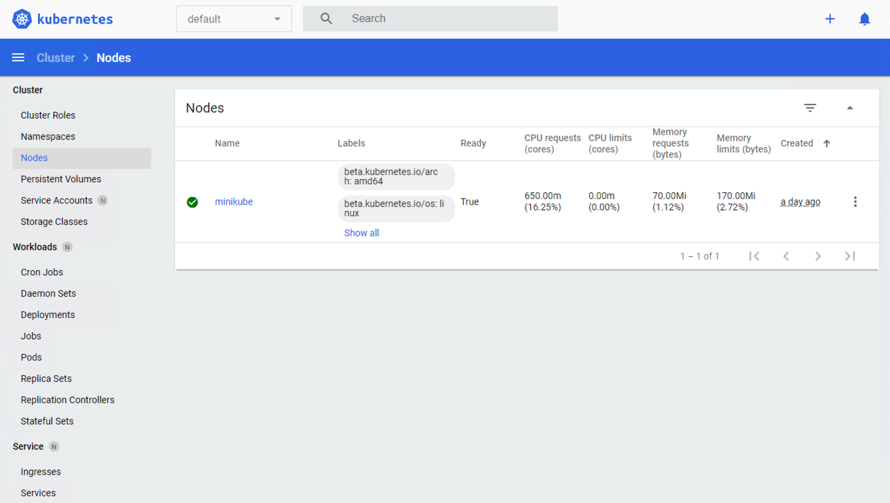

## `kubectl` (el CLI de Kubernetes)

Para la interacción con un cluster local o remoto de Kubernetes mediante comandos se usa `kubectl`, un CLI sencillo que nos permitirá realizar tareas habituales como despliegues, escalar el cluster u obtener información sobre los servicios en ejecución. `kubectl` es el CLI para interactuar con el servidor de la API de Kubernetes.

[NOTE]
====
Para más información, consultar la https://kubernetes.io/es/docs/tasks/tools/install-kubectl/#instalar-kubectl[página oficial de instalación y configuración de `kubectl`,window=_blank]
====

Para interactuar con unos ejemplos sencillo con `kubectl` podemos

* Obtener información de la versión

+
[source, bash]
----
$ kubectl version
Client Version: version.Info{Major:"1", Minor:"19", GitVersion:"v1.19.3", GitCommit:"1e11e4a2108024935ecfcb2912226cedeafd99df", GitTreeState:"clean", BuildDate:"2020-10-14T12:50:19Z", GoVersion:"go1.15.2", Compiler:"gc", Platform:"windows/amd64"}
Server Version: version.Info{Major:"1", Minor:"19", GitVersion:"v1.19.4", GitCommit:"d360454c9bcd1634cf4cc52d1867af5491dc9c5f", GitTreeState:"clean", BuildDate:"2020-11-11T13:09:17Z", GoVersion:"go1.15.2", Compiler:"gc", Platform:"linux/amd64"}
----

* Obtener información del cluster

+
[source, bash]
----
$ kubectl cluster-info
Kubernetes master is running at https://127.0.0.1:32768
KubeDNS is running at https://127.0.0.1:32768/api/v1/namespaces/kube-system/services/kube-dns:dns/proxy

To further debug and diagnose cluster problems, use 'kubectl cluster-info dump'
----

* Obtener los nodos que forman el cluster

+
[source, bash]
----
$ kubectl get nodes
NAME       STATUS   ROLES    AGE   VERSION
minikube   Ready    master   32h   v1.19.4
----

* Otras operaciones de interés son: 
    - `kubectl get pods` para listar todos los pods desplegados.
    - `kubectl get all` para listar todos los objetos desplegados.
    - `kubectl describe <resource>` para obtener información detallada sobre un recurso.
    - `kubectl logs <pod>` para mostrar los logs de un contenedor en un pod.
    - `kubectl exec <pod> <command>` para ejecutar un comando en un contenedor de un pod.

### Despliegue mediante archivos YAML

La forma de operar con Kubernetes consiste en crear archivos https://es.wikipedia.org/wiki/YAML[YAML] especificando el objeto que se quiere crear en Kubernetes (Pod, ReplicaSet, Deployment, Service, ConfigMap, Secret, Namespace, …​). Una vez creados estos archivos, se usará `kubectl` para cargarlos/desplegarlos en Kubernetes.

[TIP]
====
El uso de archivos para despliegues Kubernetes nos permitirá además beneficiarnos de las ventajas de los sistemas de control de versiones, sometiendo nuestros recursos de Kubernetes al control de versiones, facilidad de distribución y trabajo en equipo.
====

A modo de ejemplo probaremos a hacer un despliegue en Kubernetes de Nginx con 4 réplicas. En la figura se observa cómo ha sido creado el _Deployment_ `nginx`.

image::images/Workload-Nginx.png[]

[NOTE]
====
Un _Deployment_ es un objeto Kubernetes que de forma declarativa especifica, entre otros, la imagen usada para desplegar los pods, el número de réplicas deseadas, recursos (RAM, CPU, ...) solicitados para los pods, y demás.
====

Usaremos `kubectl apply -f <file-URL-or-directory>` para desplegar los objetos contenidos en los archivos de configuración especificados.

[source, bash]
----
$ kubectl apply -f https://gist.githubusercontent.com/ualmtorres/a5685c96a7119908a8d0975eff4907f7/raw/2e7d8d3a6ef64e7937e345b933223dceb2ff69d3/k8s-nginx.yml
----

.Archivo YAML de configuración
****
Un archivo YAML de configuración incluye varios elementos, entre los que destacamos estos por ahora:

* `apiVersion`: Determina los componenetes que se pueden incluir en una configuración del tipo de objeto desplegado.
* `kind`: Tipo de objeto desplegado.
* `metadata`: Metadatos del despliegue.
* `spec`: Número de réplicas del despliegue, imagen a utilizar, nombre de los pods, ...

[source, yaml]
----
apiVersion: apps/v1 <1>
kind: Deployment <2>
metadata: 
  name: nginx <3>
  labels: 
    app: nginx
spec: 
  replicas: 4 <4>
  selector: 
    matchLabels:
      app: nginx 
  template: 
    metadata:
      labels: 
        app: nginx
    spec:
      containers:
      - name: nginx <5> 
        image: nginx <6>
        ports:
        - containerPort: 80 <7>
----
<1> Versión de la API
<2> Tipo de objeto Kubernetes
<3> Nombre del deployment
<4> Número de réplicas a desplegar de cada contenedor
<5> Nombre de los contenedores
<6> Imagen a desplegar
<7> Puerto de los contenedores
****

## Componentes de Kubernetes en acción

### Namespace

Los namespaces permiten organizar los despliegues realizados en un cluster. Definen un espacio de nombres y se suele utilizar para separar los recursos de aplicaciones o usuarios. Cada recurso tiene que tener un nombre único en el namespace al que pertenezca. 

A continuación se muestra la configuración YAML para crear un namespace.

[source, yaml]
----
apiVersion: v1
kind: Namespace
metadata:
  name: demo
----

Despliegue del manifiesto para crear el pod

[source, bash]
----
$ kubectl apply -f https://gist.githubusercontent.com/ualmtorres/d9468f456eed8c65bf6f0174d8c8a591/raw/5eea37fd4d2f6c9999b0c1976576c7975c32e7a0/demons.yml
----

Tras crear el namespace, cambiaremos a él para poder ver las configuraciones que se vayan desplegando en él.

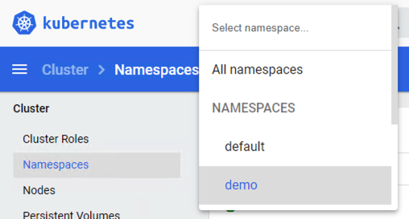

[NOTE]
====
Los namespaces no se pueden anidar.
====

Para mostrar los namespaces: `kubectl get namespaces`

[source, bash]
----
$ kubectl get namespaces
NAME                   STATUS   AGE
default                Active   38h
demo                   Active   5m1s <1>
kube-node-lease        Active   38h
kube-public            Active   38h
kube-system            Active   38h
kubernetes-dashboard   Active   38h
----
<1> Namespace creado

### Pod

Los pods son la unidad atómica de Kubernetes. Un Pod es una abstracción de Kubernetes que representa un grupo de uno o más contenedores de una aplicación y algunos recursos compartidos de esos contenedores (p.e. volúmenes, redes)

[NOTE]
====
Un ejemplo de pod con más de un contenedor lo encontramos en lo que se denominan _sidecars_. Ejemplos de sidecar los encontramos en aplicaciones que registran su actividad en un contenedor (sidecar) dentro del mismo pod y publican la actividad en una aplicación que monitoriza el cluster. Otro ejemplo de sidecar es el de un contenedor sidecar que proporciona un certificado SSL para comunicación https al contenedor de la aplicación. Otro ejemplo más lo podemos encontrar en un sidecar que actúa como volumen.
====

Los contenedores de un pod comparten una IP y un espacio de puertos, y siempre van juntos y se despliegan juntos en un nodo. La figura siguiente ilustra varias configuraciones de pods: 

* Pod 1: Un pod con un contenedor
* Pod 2: Un pod con un contenedor y un volumen
* Pod 3: Un pod con dos contenedores que comparten un volumen
* Pod 4: Un pod con varios contenedores y varios volúmenes

image::images/KubernetesPod.svg[]

#### Creación de un pod con una web básica

Para ilustrar cómo crear un pod mediante una manifiesto YAML, veremos cómo crear uno sencillo para uns web básica. Para ir familiarizándonos con Kubernetes, probaremos también con unos comandos básicos para mostrar información, mostrar los logs y redirección de puertos

Comenzaremos con la creación del manifiesto YAML.

[source, yaml]
----
apiVersion: v1
kind: Pod <1>
metadata:
  name: myweb <2> 
  namespace: demo <3>
spec:
  containers:
    - name: myweb <4>
      image: ualmtorres/myweb:v0 <5>
----
<1> Pod como objeto Kubernetes a desplegar
<2> Nombre del pod
<3> Namespace donde se alojará el pod
<4> Nombre del contenedor dentro del pod
<5> Imagen para crear el contenedor

[NOTE]
====
En este caso el pod definido sólo tiene un contenedor. Los contenedores de un poc se definen en el elemento `containerrs` de `spec`.
====

A continución, realizaremos el despliegue del manifiesto para crear el pod.

[source, bash]
----
$ kubectl apply -f https://gist.githubusercontent.com/ualmtorres/3cd0bd79b7179c8b4e208a5b7d6b4b70/raw/fc0a1a08df26b20d9e75065a75c44c1cefa3ceb1/myweb.yml
----

El pod se mostrará creado en la zona de pods.

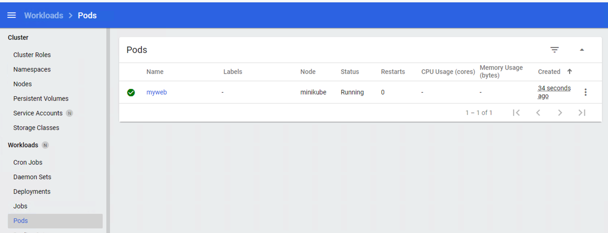

Para mostrar el pod creado en el namespace `demo`: 

[source, bash]
----
$ kubectl get pods -n demo
NAME    READY   STATUS    RESTARTS   AGE
myweb   1/1     Running   0          4m22s
----

Si no se especifica el namespace, `kubectl` devuelve los pods del namespace `default`.

[source, bash]
----
$ kubectl get pods
NAME                     READY   STATUS    RESTARTS   AGE
nginx-7764c7498d-gh86h   1/1     Running   0          4h22m
nginx-7764c7498d-m9cxr   1/1     Running   0          4h22m
nginx-7764c7498d-mt8r7   1/1     Running   0          4h22m
nginx-7764c7498d-svfkb   1/1     Running   0          4h22m
----

**Inicio de sesión SSH en el pod**

[source, bash]
----
$ kubectl -n demo --stdin --tty exec myweb -- /bin/bash
----

**Mostrar información del pod**

[source, bash]
----
$  kubectl describe pod -n demo myweb
----

**Mostrar los logs del pod**

[source, bash]
----
$ kubectl logs -n demo myweb
----

**Redirección del puerto del pod a un puerto local (establece un túnel SSH entre nuestro equipo y el pod con los puertos indicados)**

[source, bash]
----
$ kubectl port-forward -n demo myweb 80:80 
----

[NOTE]
====
Al hacer un _port-foward_ el primer puerto es el local. El segundo es el del contenedor.
====

Ahora en `localhost` podremos ver que es lo que está sirviendo el contenedor en el puerto 80.

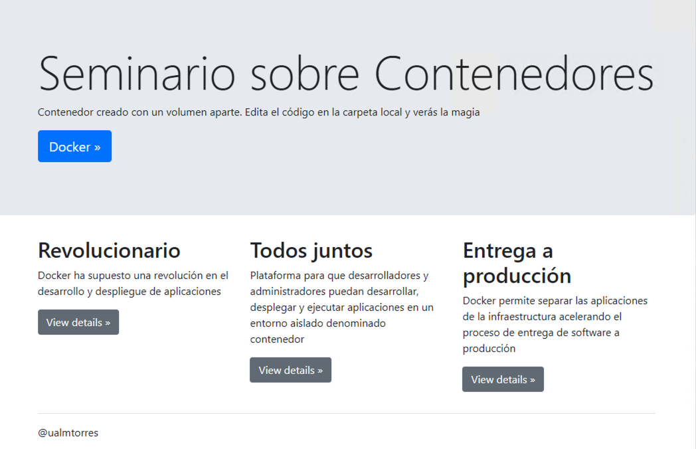

**Eliminación del pod**

[source, bash]
----
$ kubectl delete -f https://gist.githubusercontent.com/ualmtorres/3cd0bd79b7179c8b4e208a5b7d6b4b70/raw/fc0a1a08df26b20d9e75065a75c44c1cefa3ceb1/myweb.yml
----

.Nodos
****
Los pods se ejecutan en un Nodo. Un nodo es una máquina _worker_ (física o virtual) del cluster. Los nodos están gestionados por el Master. Un Nodo puede contener muchos pods.

image::images/KubernetesNode.svg[]

Cada Nodo ejecuta al menos:

* `Kubelet`, un proceso que se encarga de la comunicación entre el nodo y el Master. Gestiona los pods y los contenedores que se están ejecutando en el nodo.
* Un motor de contenedores, como Docker, que se encarga de la descarga de imágenes de un registro y de ejecutar la aplicación.
****

### Deployment

Normalmente no desplegaremos Pods. En su lugar desplegaremos Deployments. En ellos podremos incluir contenedores con imágenes diferentes para que puedan trabajar de forma coordinada. Un ejemplo habitual es el de frontend y backend. En la especificación de los contenedores indicaremos además de la imagen de partida, número de réplicas, recursos solicitados (p.e. cantidad de RAM, porcentaje de CPU, ...). Esto, además de desacoplar frontend y backend, desde el punto de vista de la escalabilidad, permite escalar frontend y backend de forma independiente.

[NOTE]
====
Un archivo de Deployment proporciona una forma declarativa de creación de Pods y ReplicaSets. En el archivo de Deployment se especifica el estado deseado.
====

Una configuración de Deployment pide a Kubernetes que cree y actualice las instancias de una aplicación. Tras crear el Deployment, el Master organiza las instancias de aplicación en los nodos disponibles del cluster.

image::images/KubernetesDeployment.svg[]

Una vez creadas las instancias de aplicación, el *Controlador de Deployment de Kubernetes* monitoriza continuamente las instancias. Si un nodo en el que está una instancia cae o es eliminado, el Controlador de Deployment de Kubernetes sustituye la instancia por otra instancia en otro nodo disponible del cluster.

Esta funcionalidad de _autocuración_ de las aplicaciones supone un cambio radical en la gestión de las aplicaciones. Esta característica de recuperación de fallos mediante la creación de nuevas instancias que reemplazan a las defectuosas o desaparecidas no existía antes de los orquestadores.

Al crear un Deployment se especifica la imagen del contenedor que usará la aplicación y el número de réplicas que se quieren mantener en ejecución. El número de réplicas se puede modificar en cualquier momento actualizando el Deployment.

Para ilustrar el uso de `Deployment` vamos a ver un ejemplo de despliegue que incluye una API y una aplicación que consume de ella. Lo haremos de forma separada para poder ilustrar su funcionamiento.

#### Despliegue de la API

La API de este ejemplo devuelve datos de tenistas de la ATP. A continuación se muestran los endpoints de la API.

.Endpoints de Tennis API
[width="100%",options="header"]
|====================
| Método | Endpoint |  Descripción
| `GET` | `player` |  Obtiene lista de identificadores de jugadores
| `GET` | `player/{id}` |  Devuelve información sobre un jugador específico
| `GET` | `country` |  Obtiene lista de identificadores de países
| `GET` | `country/{id}` |  Devuelve el país y todos sus jugadores
|====================

Este sería el archivo de despliegue.

[source, yaml]
----
apiVersion: apps/v1
kind: Deployment <1>
metadata:
  name: tennis-api <2>
  namespace: demo <3> 
  labels:
    app: tennis-api <4>
spec:
  revisionHistoryLimit: 2 <5>
  strategy:
    type: RollingUpdate <6>
  replicas: 2 <7>
  selector:
    matchLabels:
      app: tennis-api <8>
  template: <9>
    metadata:
      labels: <10>
        app: tennis-api
    spec:
      containers:
      - name: tennis-api <11>
        image: ualmtorres/tennis-api:v0 <12>
        ports:
        - name: http
          containerPort: 80 <13>
----
<1> Tipo de recurso a desplegar
<2> Nombre del despliegue
<3> Namespace de despliegue
<4> Etiqueta que usar el Deployment para ser luego seleccionado por otro objeto Kubernetes (p.e. Service).
<5> Número de versiones almacenadas para poder deshacer despliegues fallidos
<6> Tipo de estrategia de actualización
<7> Número de réplicas del despliegue
<8> Selector que define cómo el Deployment encuentra los Pods a gestionar, *que coincide con el definido en la plantilla (template) del pod*
<9> Zona (plantilla) de definición del pod
<10> Etiquetas asignadas a los pods y que les permitirán ser seleccionados para formar parte de un Deployment
<11> Prefijo usado para los pods
<12> Imagen base para los contenedores de la aplicación
<13> Puerto por el que la aplicación sirve originalmente sus datos

[NOTE]
====
La estrategia de despliegue (`spec.strategy.type`) puede ser `Recreate` o `RollingUpdate`, que es el valor predeterminado.
====

El despliegue se realiza con `kubectl` con el comando siguiente

[source, bash]
----
$ kubectl apply -f https://gist.githubusercontent.com/ualmtorres/0729de5e0ff5b5fdd931abcc6aa2fc5a/raw/a5e992b4e240d011b01749ec16d01bdd3c0bf7b1/tennis-api-deployment.yml
----

Al crear el despliegue, se procederá a descargar la imagen y se pasarán a crear los dos pods indicados para este despliegue. Podemos ver los pods creados con el comando siguiente comprobando que efectivamente se creado los dos pods jsonreader que exigía el despliegue.

Podemos ver los pods del despliegue con el comando siguiente

[source, bash]
----
$ kubectl get pods -n demo
NAME                          READY   STATUS    RESTARTS   AGE
tennis-api-69868cf47b-hslq6   1/1     Running   0          10s
tennis-api-69868cf47b-j8gmd   1/1     Running   0          10s
----

Este comando ha hecho que el Master haya buscado nodos para ejecutar la API, haya programado la ejecución de la API en esos nodos y haya configurado el cluster para programar la ejecución de otras instancias cuando sea necesario.

[NOTE]
====
Para imágenes que no estén en Docker Hub se pasa la URL completa del repositorio de imágenes.
====

Ahora podríamos ver a cualquiera de los pods de `tennis-api` haciendo _port forward_ a nuestro equipo.

[source, bash]
----
$ kubectl port-forward tennis-api-69868cf47b-hslq6 -n demo 80:80
Forwarding from 127.0.0.1:80 -> 80
Forwarding from [::1]:80 -> 80
----

Este sería el resultado de una llamada a la API (`http://localhost/player/rafael-nadal`).

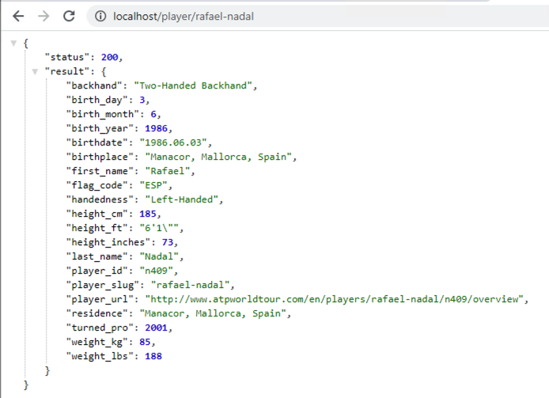

Para obtener los Deployments disponibles

[source, bash]
----
$ kubectl get deployments -n demo

NAME         READY   UP-TO-DATE   AVAILABLE   AGE
tennis-api   2/2     2            2           13s
----

#### Despliegue de la aplicación

La aplicación de este ejemplo comienza mostrando la lista de países de la API para que seleccionemos en cuál estamos interesados en mostrar sus jugadores.

Este sería el archivo de despliegue.

[source, bash]
----
apiVersion: apps/v1
kind: Deployment 
metadata:
  name: tennis-app 
  namespace: demo 
  labels:
    app: tennis-apo
spec:
  revisionHistoryLimit: 2 
  strategy:
    type: RollingUpdate 
  replicas: 2 
  selector:
    matchLabels:
      app: tennis-app 
  template: 
    metadata:
      labels: 
        app: tennis-app
    spec:
      containers:
      - name: tennis-app 
        image: ualmtorres/tennis-app:v0 <1>
        ports:
        - name: http
          containerPort: 80
----
<1> Despliegue realizado a partir de la imagen de la aplicación

El despliegue se realiza con `kubectl` con el comando siguiente

[source, bash]
----
$ kubectl apply -f https://gist.githubusercontent.com/ualmtorres/3d4d28d2a245bbd348c300fa9594f133/raw/b3c799c50bb00c8536fd7c67523f9f0ed38eef0a/tennis-app-deployment.yml
----

Ahora vemos que han aumentado los pods disponibles. Ahora están los de la API y los de la aplicación. Podemos ver los pods del despliegue con el comando siguiente

[source, bash]
----
$ kubectl get pods -n demo
NAME                          READY   STATUS    RESTARTS   AGE
tennis-api-69868cf47b-hslq6   1/1     Running   0          5m
tennis-api-69868cf47b-j8gmd   1/1     Running   0          5m
tennis-app-c9cdf4cbf-n7klt    1/1     Running   0          6m
tennis-app-c9cdf4cbf-nnz5x    1/1     Running   0          6m
----

Ahora podríamos ver a cualquiera de los pods de `tennis-app` haciendo _port forward_ a nuestro equipo. Usaremos el puerto `81` local porque tenemos ocupado el `80` con la API.

[source, bash]
----
$ kubectl port-forward -n demo tennis-app-c9cdf4cbf-n7klt 81:80
Forwarding from 127.0.0.1:81 -> 80
Forwarding from [::1]:81 -> 80
----

Sin embargo, vemos que la aplicación no puede recuperar los datos de la API. Esto se debe a que aún no hay definido un servicio. Los servicios gestionan el descubrimiento y enrutado entre pods dependientes (p.e. aplicación y API). En la siguiente sección encontraremos la solución a ese problema.

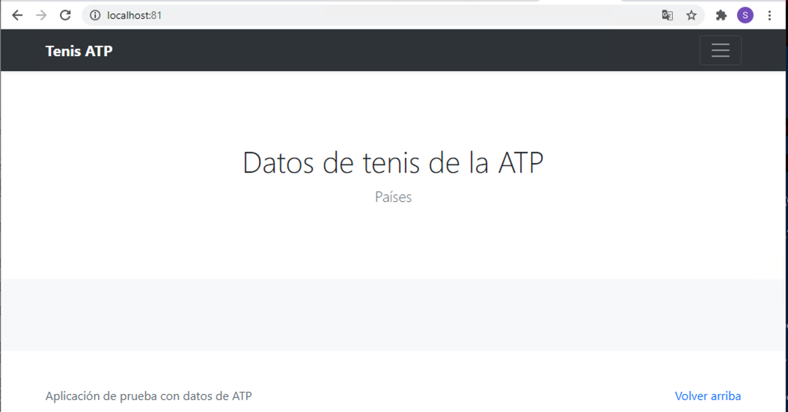

### Service

Un `Service` es una abstracción que define una agrupación de Pods y una política de acceso a ellos. El conjunto de Pods al que se dirige un Service están determinados por un *selector*.

.Agrupación de pods en servicios
****
Los pods pueden ser etiquetados con metadatos. Estos metadatos posteriormente pueden ser usados por otros objetos Kubernetes (p.e. ReplicaSet, Deployment) para seleccionar los pods y crear una unidad lógica (p.e. todas las réplicas de un contenedor de frontend)

La figura siguiente ilustra como un servicio agrupa mediante el *selector* `app:ngnix` a aquellos pods que están etiquetados con `app:ngnix`.

image::images/podlabels.png[]

[source,yaml]
----
apiVersion: apps/v1 
kind: Deployment 
metadata: 
  name: nginx
  labels: 
    app: nginx
spec: 
  replicas: 2 
  selector: 
    matchLabels: <1>
      app: nginx 
  template: 
    metadata:
      labels: <2>
        app: nginx
    spec:
      containers:
      - name: webcontainer 
        image: nginx 
        ports:
        - containerPort: 80 
----
<1> Condición para buscar
<2> Condición para ser encontrado

Al desplegar este deployment se crearán dos pods (`replicas: 2`), que quedarán agrupados por la coincidencia entre el selector que pide el deployment (`app: nginx`) y la etiqueta con los que son creados los pods (`app: nginx`).

[source, bash]
----
$ kubectl apply -f ngnix.yaml
----

Si ahora vemos los detalles del deployment en el dashboard de Minikube veremos que los dos pods de Nginx creados están agrupados lógicamente en el deployment `ngnix`. Esta información está realmente en el objeto ReplicaSet creado por el Deployment.

image::images/ReplicaSetPods.png[]
****

Cada pod tiene una dirección IP única, pero esa IP no se expone fuera del cluster sin lo que se denomina un Servicio. *Los servicios pemiten que las aplicaciones reciban tráfico*. 

#### Tipos de servicio

En función del ámbito de la exposición del servicio tenemos:

* `ClusterIP`: El servicio recibe una IP interna a nivel de cluster y hace que el servicio sólo sea accesible a nivel de cluster.
* `NodePort`: Expone el servicio fuera del cluster concatenando la IP del nodo en el que está el pod y un número de puerto entre 30000 y 32767, que es el mismo en todos los nodos
* `LoadBalancer`: Crea en cloud, si es posible, un balanceador externo con una IP externa asignada.
* `ExternalName`: Expone el servicio usando un nombre arbitrario (especificado en `externalName`)

image::images/KubernetesService.svg[]

Los servicios enrutan el tráfico entre los pods proporcionando una abstracción que permite que los pod mueran y se repliquen sin impactar en la aplicación. 

[NOTE]
====
El descubrimiento y enrutado entre pods dependientes (p.e. API y aplicación) son gestionados por los Servicios. Los servicios agrupan a sus pods usando etiquetas y selectores. Los servicios usan selectores y los pods son creados con etiquetas. Su emparejamiento por valores coincidentes es lo que agupa los pods en un servicio. 
====

Las etiquetas son pares clave-valor y tienen usos muy variados:

* Seleccionar los objetos de un despliegue
* Diferenciar entre objetos de desarrollo, prueba y producción
* Distinguir entre versiones

image::images/KubernetesLabels.svg[]

En la figura se observa cómo el selector de etiquetas usado en los Deployment sirve para agrupar los pods que conforman un servicio, ya que cada pod contiene la misma etiqueta usada en el selector del Deployment al que pertenece.

Las etiquetas se pueden configurar durante la creación o en cualquier momento posterior.

[TIP]
====
Prueba a editar en el dashboard de kubernetes uno de los pods de Nginx cambiándole la etiqueta (p.e. `app:apache`). Esto hará que ese pod salga del ReplicaSet al que pertenecía y se cree automáticamente un nuevo pod etiquetado con `app:nginx`. De esto se encarga el Deployment, que de acuerdo a su especificación exige tener 2 réplicas en ejecución de pods con etiquetas `app:nginx`.
====

#### Despliegue del Service

Vamos a crear un archivo de Service denominado `tennis-api-service.yml`. Este archivo básicamente contiene entre otros el nombre de servicio, el tipo del servicio (ClusterIP, NodePort, ...), el puerto de acceso a los pods del despliegue y el selector que identifica al despliegue con el que se corresponde el servicio creado.

[source, yaml]
----
apiVersion: v1
kind: Service <1>
metadata:
  name: tennis-api <2>
  namespace: demo <3>
spec:
  type: NodePort <4>
  ports:
  - name: http
    port: 80 <5>
    targetPort: http
  selector:
    app: tennis-api <6>
----
<1> Tipo de recurso a desplegar
<2> Nombre del servicio
<3> Namespace de despliegue
<4> Tipo de servicio. NodePort hará que el servicio esté disponible en la IP de los nodos en los que estén los pods y un puerto aleatorio entre 30000 y 32767
<5> Puerto en el que los pods están sirviendo su contenido
<6> Etiqueta que usa el servicio para localizar al Deployment. Buscará un valor coincidente en la etiqueta `labels` del Deployment.

El despliegue se realiza con `kubectl` con el comando siguiente

[source, bash]
----
$ kubectl create -f https://gist.githubusercontent.com/ualmtorres/1a8ecdf86088321d757962b22834db55/raw/5f701537d82f60ae050e41f70235ed9f1f68f4d9/tennis-api-service.yml
----

El despliegue nos permitirá acceder a la aplicación en un puerto en el rango 30000-32767. En este caso ha tocado el 31274

[source, bash]
----
$ kubectl get services -n demo
NAME         TYPE       CLUSTER-IP      EXTERNAL-IP   PORT(S)        AGE
tennis-api   NodePort   10.105.134.43   <none>        80:31274/TCP   11h
----

Una vez desplegado el servicio, la aplicación ya sí podrá recuperar los datos de la API. La figura siguiente muestra la aplicación mostrando la lista de países con jugadores en la ATP.

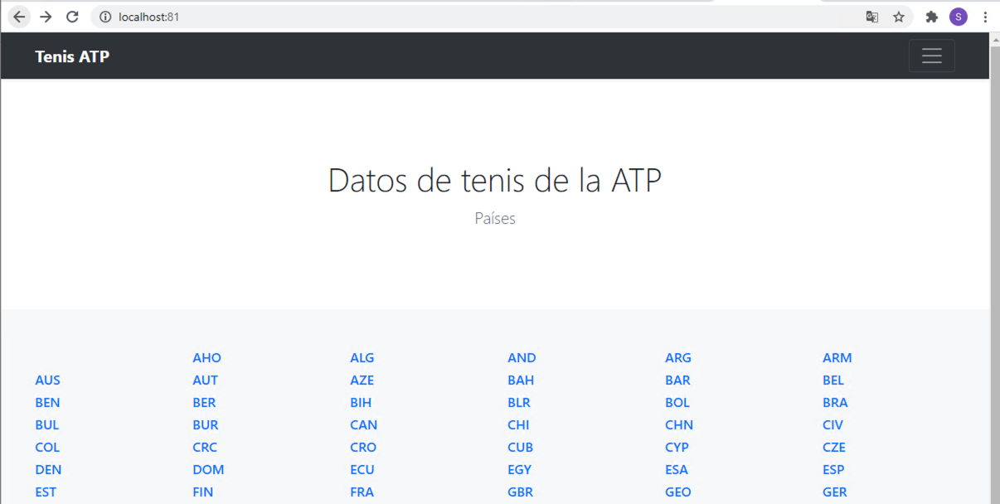

Si se selecciona alguno de los países (p.e. `ESP`) se mostrarán los jugadores de la ATP desde sus inicios. Los datos tambiéne son recuperados de la API. La figura siguiente muestra jugadores españoles.

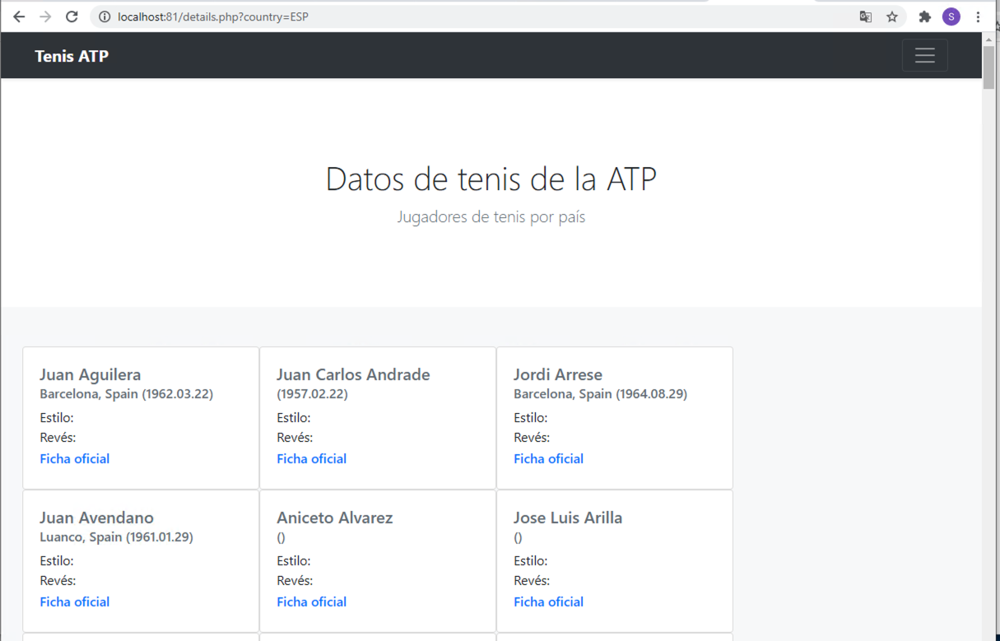

También podemos usar el Kubernetes Dashboard para mostrar información de interés sobre este despliegue, viendo como los Deployment de `tennis-api` y `tennis-app` se han incorporado a la lista de despliegues disponibles en el cluster, así como los Pods, ReplicaSets y Services, como muestran las figuras siguientes.

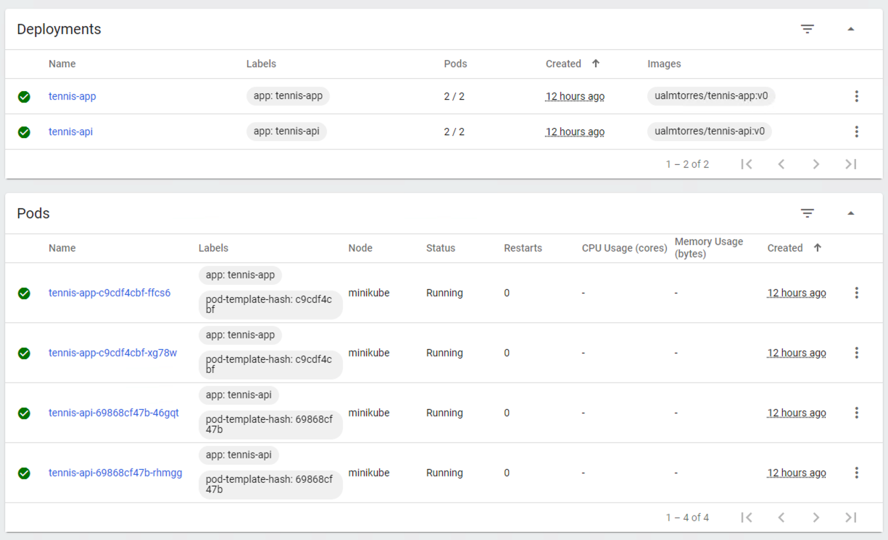

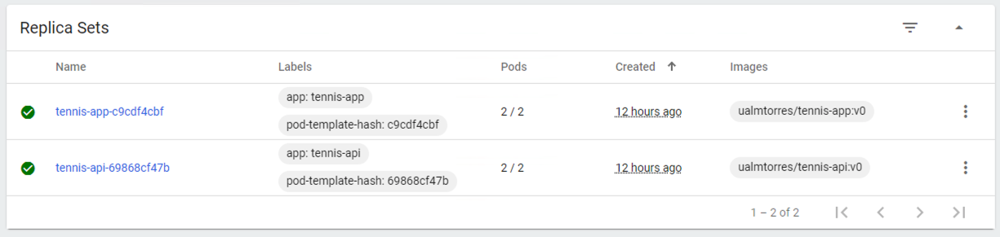

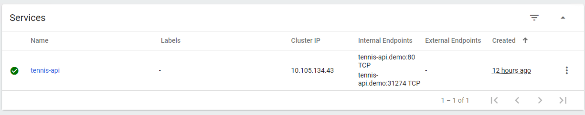

Recordemos que la aplicación no podía obtener la lista de países que ofrecía la API. Esto se debía a que se había desplegado el Deployment de la API, pero no se había desplegado su Service, que es lo que le da visibilidad.

Al desplegar el servicio de la API ya podremos ver que la aplicación ya sí puede acceder a los datos que genera la API.

.Service completo para la aplicación y la API
****
El `Service` desplegado anteriormente permite que la aplicación funcione correctamete recuperando datos de la API. Sin embargo, para poder ver la aplicación es necesario hacer un _port-forward_ a unos de los pods de la aplicación. Esto se debe a que el `Deployment` de la aplicación no tiene un `Service`. Hemos definido uno para que la API pueda ser vista por la aplicación, pero la aplicación no puede ser vista. En este caso, el ámbito de visibilidad debe ser Internet, no sólo a nivel de cluster o de nodo.

El ejemplo siguiente muestra un manifiesto completo que incluye dos `Service` (el de la API que ya teníamos y uno nuevo para la aplicación).

[source, yaml]
----
apiVersion: v1
kind: Service 
metadata:
  name: tennis-api 
  namespace: demo 
spec:
  type: NodePort <1>
  ports:
  - name: http
    port: 80 
    targetPort: http
  selector:
    app: tennis-api
---
apiVersion: v1
kind: Service 
metadata:
  name: tennis-app
  namespace: demo 
spec:
  type: LoadBalancer <2>
  ports:
  - name: http
    port: 80 
    targetPort: http
  selector:
    app: tennis-app
----
<1> `Service` de la API de tipo `NodePort` para que sea visto por la aplicación sin exponer la API fuera del cluster
<2> `Service` de la aplicación de tipo `LoadBalancer` para que pueda recibir una IP accesible desde Internet.

El despliegue se realiza con `kubectl` con el comando siguiente

[source, bash]
----
https://gist.githubusercontent.com/ualmtorres/2a0a96749a8b0ced6b8fdd81a9258920/raw/23463255967a4156d1390befdd3bec872ae79bc0/tennis-service.yml
----

Esto devolverá una IP y la aplicación podrá ser accesible desde fuera del cluster Kubernetes.
****

### ConfigMaps

Los objetos ConfigMap permiten almacenar datos en forma de pares clave-valor para que puedan usarse posteriormente en despliegues parametrizados y hacerlos más portables.

Usaremos los ConfigMap para almacenar datos no sensibles sobre la configuración. Deben ser datos no sensibles porque los datos se guardan tal cual.

A cada `ConfigMap` le asignaremos un nombre, opcionalmente un namespace, y pares clave-valor.

A continuación se muestra el manifiesto YAML que crea un `ConfigMap initsqlsource` que contiene una propiedad `source` inicializada con un script SQL de inicialización que podrá ser usado más adelante para inicializar una base de datos MySQL.

[source, yaml]
----
apiVersion: v1
kind: ConfigMap
metadata:
  name: initsqlsource
  namespace: demo
data:
  source: https://gist.githubusercontent.com/ualmtorres/eb328b653fcc5964f976b22c320dc10f/raw/448b00c44d7102d66077a393dad555585862f923/init.sql
----

Desplegaremos el ConfigMap con:

[source, bash]
----
$ kubectl apply -f https://gist.githubusercontent.com/ualmtorres/21383a48ac1f93f9cb3db3eb61e69a77/raw/5b0722bd0a85f98e18609262d7e210ea73fe5476/initsqlsource-configmap.yml
----

Podemos obtener los `ConfigMap` definidos con 

[source, bash]
----
$ kubectl get configmap -n demo

NAME            DATA   AGE
initsqlsource   1      102s
----

Para recuperar los datos del `ConfigMap` usaremos `kubectl describe`
[source, bash]
----
$ kubectl describe configmap initsqlsource -n demo

Name:         initsqlsource
Namespace:    demo
Labels:       <none>
Annotations:  <none>

Data
====
source:
 ----
https://gist.githubusercontent.com/ualmtorres/eb328b653fcc5964f976b22c320dc10f/raw/448b00c44d7102d66077a393dad555585862f923/init.sql
Events:  <none>
----

### Secrets 

Los objetos Secret se usan para almacenar información sensible, como contraseñas, tokens OAuth y claves ssh. Colocar esta información en objetos Secret es más seguro que colocarla en texto plano y legible.

No obstante, los datos de los objetos Secret no están cifrados. Están codificados en base64 y pueden hacerse visibles fácilmente. Sistemas como https://www.vaultproject.io/[Vault] son usados de forma complementaria para aumentar la seguridad de la información que contienen los Secret.

Kubernetes guarda los secretos en base64. Por tanto, los valores que vayamos a almacenar en los pares clave-valor de un secreto tendrán que estar en base64.

Para codificar en base64 el valor password que utilizamos en el ejemplo anterior para contraseña del root, ejecutaremos el comnando siguiente desde la línea de comandos:

    $ echo -n 'secret' | base64

[TIP]
====
Los usuarios de Windows ejecutarían este comando en `Git Bash`.
====

Esto devolverá la cadena `c2VjcmV0`, que corresponde a la cadena `secret` en base64. Este valor codificado será el que usaremos para la creación del `Secret`.

A cada `Secret` le asignaremos un nombre, opcionalmente un namespace, y pares clave-valor.

A continuación crearemos el manifiesto YAML que inicializa un objeto `Secret` que podrá ser usado más adelante para inicializar una contraseña (p.e. para un usuario MySQL).

[source, yaml]
----
apiVersion: v1
kind: Secret
metadata:
  name: mysqlpassword
  namespace: demo
type: Opaque
data:
  password: c2VjcmV0
----

Lanzamos la creación del `Secret` con `kubectl`:

    kubectl apply -f https://gist.githubusercontent.com/ualmtorres/68afc7b823d01b2ef3e2e929473ad4c0/raw/3b8890ad22c4c248ec1b7aaf04327f132589010f/mysqlpassword-secret.yml

Podemos obtener los `Secret` definidos con 

[source, bash]
----
$ kubectl get secret -n demo

NAME                  TYPE                                  DATA   AGE
default-token-55xhz   kubernetes.io/service-account-token   3      2d13h
mysqlpassword         Opaque                                1      112s
----

Para recuperar los datos del `Secret` usaremos `kubectl describe`

[source, bash]
----
$ kubectl describe secret mysqlpassword -n demo

Name:         mysqlpassword
Namespace:    demo
Labels:       <none>
Annotations:  <none>

Type:  Opaque

Data
====
password:  6 bytes
----

## Almacenamiento básico en volúmenes

El almacenamiento en contenedores es efímero. Una vez que el contenedor es eliminado también son eliminados sus archivos. Pero además, cuando un contenedor falla, `kubelet` lo reiniciará con un estado limpio habiéndose perdido todo lo que había en sus archivos.

Kubernetes cuenta con una gran cantidad de https://kubernetes.io/docs/concepts/storage/volumes/#types-of-volumes[tipos de volúmenes]. Los hay de almacenamiento local, almacenamiento en el sistema de archivos de los nodos de Kubernetes, Ceph, Gluster, NFS y almacenamiento cloud, como en Amazon, Azure, Google Cloud y OpenStack Cinder, por citar algunos. También permite volúmenes `configmap` y `secret`, útiles para el compartir entre pods datos de configuración o información sensible, como contraseñas. En cualquier caso, los volúmenes son montados por los pods y accederían a sus datos.

### Volúmenes `emptyDir`

Se trata de volúmenes que se crean al asignar un pod a un nodo. Su contenido se mantiene en el nodo hasta que el contenedor sea eliminado.

De forma predeterminada, los volúmenes `emptyDir` son almacenados en el medio de almacenamiento prederminado del nodo (HD, SSD, NAS, ...). No obstante, se puede definir este tipo de volúmenes como volátiles configurando la propiedad `emptyDir.medium` como `Memory` y Kubernetes lo montará como un sistema de archivos RAM, lo que puede ser muy útiles para cachés.

Este tipo de contenedores se suele usar para situaciones en las que queremos compartir datos entre varios contenedores en un pod, cachés o archivos de inicialización.

El manifiesto siguiente crea un pod con https://redis.io/[Redis] usando un volumen `emptyDir`. El volumen se monta en el directorio `/data` del contenedor, que es el directorio predeterminado de almacenamiento de la https://hub.docker.com/_/redis[imagen de Redis].

[source, yaml]
----
apiVersion: v1
kind: Pod
metadata:
  name: redis
spec:
  containers:
  - name: redis
    image: redis
    volumeMounts: <1>
    - name: redis-storage <2>
      mountPath: /data <3>
  volumes: <4>
  - name: redis-storage <5>
    emptyDir: {} <6>
----
<1> Montaje de un volumen en el contenedor
<2> Nombre del volumen a montar
<3> Ruta del contenedor donde se va a montar el volumen
<4> Definición del volumen
<5> Nombre asignado al volumen
<6> Tipo de volumen

A continuación ya podremos desplegar este pod con un volumen `emptyDir` usando `kubectl`

[source, bash]
----
$ kubectl apply -f https://gist.githubusercontent.com/ualmtorres/8b07222dab628fb2e4ac7ef01ade45ad/raw/61535f51d438c1bb2ab0fac8a50dc9772e27fb96/redis-with-emptydir.yml
----

.Ubicación del volumen en el nodo
****
El volumen es creado en un directorio dentro del directorio del pod en el nodo. La ruta es esta

    /var/lib/kubelet/pods/PODUID/volumes/kubernetes.io~empty-dir/VOLUMENAME
    
El `uid` lo podemos obtener con un comando como este en `Git Bash`

[source, bash]
----
$ kubectl get pods -n demo redis -o yaml | grep uid
  uid: 295bddba-6b10-4d40-99e3-130e99f2b394
----
****

### Volúmenes `hostPath`

Un volumen `hostPath` monta en el contenedor un archivo o un directorio del sistema de archivos del nodo en el que está ejecutándose el pod. 

[NOTE]
====
Este tipo de volúmenes no es una solución buena para clusters Kubernetes con varios nodos, ya que no se guardarían los mismos datos en cada nodo. 

No obstante se podrá valorar si https://rsync.samba.org/[rsync] o https://syncthing.net/[Syncthing] ofrecen soporte suficiente para usar volúmenes `hostPath` en clusters con más de un nodo.
====

El ejemplo siguiente muestra un manifiesto para la creación de un pod con un contenedor Apache que monta un volumen `hostPath`. El contenedor monta ese volumen (`/var/local/apache-vol`) en la carpeta de publicación del contenedor Apache (`/usr/local/apache2/htdocs/`).

[source, yaml]
----
apiVersion: v1
kind: Pod
metadata:
  name: apache-hostpath
  namespace: demo
spec:
  containers:
  - image: httpd
    name: apache-hostpath
    volumeMounts:
    - mountPath: /usr/local/apache2/htdocs/
      name: myvolume
  volumes:
  - name: myvolume
    hostPath:
      path: /var/local/apache-vol
      type: DirectoryOrCreate
----

A continuación ya podremos desplegar este pod con un volumen `hostPath` usando `kubectl`

    $ kubectl apply -f https://gist.githubusercontent.com/ualmtorres/6d69e5cfcecea5a1376066282907b865/raw/5267db3c6e38bc31b6284f690b6a2a51c9a6c56f/apache-hostpath.yml

[NOTE]
====
Crear volúmenes `hostPath` es una operación atrevida, ya que estamos accediendo e incluso escribiendo en el sistema de archivos del nodo en el que esté el pod.

Es posible controlar la creación del volumen para montar un archivo o directorio del nodo sólo en aquellos casos en los que previamente exista dicho archivo o directorio. Para ello, tenemos que crear el volumen con `type: Directory`. Esto hará que sólo se cree el pod si existen el directorio previamente en el nodo.

[source, yaml]
----
  volumes:
  - name: myvolume
    hostPath:
      type: Directory <1>
      path: /var/local/apache-vol
----
<1> Sólo se creará el volumen si existe en el nodo el directorio especificado en `path`

Para más información sobre cómo limitar y configurar el uso de `hostPath`, consultar la https://kubernetes.io/docs/concepts/storage/volumes/#hostpath[documentación oficial de volúmenes `hostPath`]
====

## Init Containers

Existen un tipo especial de contenedores denominados _Init Containers_ que se ejecutan antes que el resto de contenedores de aplicación del pod. Este tipo de contenedores suelen dedicarse a realizar operaciones de inicialización que no están presentes en la imagen de los otros contenedores del pod.

Para ilustrar el uso de Init Container supongamos que queremos tener disponibles distintos tipos de bases de datos MySQL para pruebas en desarrollo.. En función del proyecto en el que estemos trabajando queremos tener disponible una base de datos u otra (p.e. recursos humanos, espacios, expedientes, préstamos, ...). Para ello, contaremos con varios scripts diferentes de inicialización de los distintos tipos de bases de datos que queremos configurar.

Para llevar a cabo ese caso práctico contaremos con:

* URL donde se encuentra el script de inicialización de la base de datos.
* ConfigMap que configura la URL del script con el que se va a inicializar la base de datos.
* Secret el que se almacena la contraseña del usuario `root`.
* Init Container que inicializa una imagen `busybox` con un volumen donde descarga el script SQL que inicializa la BD. La URL de descarga del script la toma del ConfigMap. El script SQL se descarga con el nombre `init.sql` en el directorio `/docker-entrypoint-initdb.d` para que sirva como script de inicialización del contenedor MySQL.

+ 
[NOTE]
====
La imagen `busybox` contiene gran cantidad de utilidades Linux incorporadas y nos va a ser muy útil para realizar la tarea de inicialización de la base de datos en su contenedor compañero de MySQL
====

* Contenedor que monta el volumen que ha inicializado el Init Container con el script SQL. Dicho volumen es montando en el directorio `/docker-entrypoint-initdb.d` de la imagen MySQL. Como el script `init.sql` está situado en el directorio `/docker-entrypoint-initdb.d`, al arrancar por primera vez el contenedor MySQL, se inicializará el contenedor con la base de datos elegida.

Esta configuración con Init Containers permite la configuración a medida y sobre la marcha de una imagen MySQL sin necesidad de tener disponibles diferentes imágenes MySQL, cada una con su propia base de datos. En su puesto, lo que hacemos es cambiar en el ConfigMap la URL del script que inicializará una nueva base de datos. Con esto podremos tener todas las bases de datos diferentes que queramos con una única imagen MySQL.

A continuación se muestra el manifiesto YAML que crea el ConfigMap que contiene el script SQL de inicialización de la base de datos. Este ConfigMap ya lo creamos cuando tratamos los ConfigMap.

ConfigMap
[source, yaml]
----
apiVersion: v1
kind: ConfigMap
metadata:
  name: initsqlsource
data:
  source: https://gist.githubusercontent.com/ualmtorres/eb328b653fcc5964f976b22c320dc10f/raw/448b00c44d7102d66077a393dad555585862f923/init.sql
----

Desplegaremos el ConfigMap con:

[source, bash]
----
$ kubectl apply -f https://gist.githubusercontent.com/ualmtorres/21383a48ac1f93f9cb3db3eb61e69a77/raw/5b0722bd0a85f98e18609262d7e210ea73fe5476/initsqlsource-configmap.yml
----

También contaremos con un objeto Secret para almacenar la contraseña del usuario root. Este sería su manifiesto YAML. Este Secret ya lo creamos cuando tratamos los Secret.

[source, yaml]
----
apiVersion: v1
kind: Secret
metadata:
  name: mysqlpassword
type: Opaque
data:
  password: c2VjcmV0
----

Desplegaremos el Secret con:

[source, bash]
----
$ kubectl apply -f https://gist.githubusercontent.com/ualmtorres/68afc7b823d01b2ef3e2e929473ad4c0/raw/3b8890ad22c4c248ec1b7aaf04327f132589010f/mysqlpassword-secret.yml
----

Por último, crearemos el pod que incluye el contenedor MySQL y el Init Container que lo inicializa. El pod contiene un volumen que comparten ambos contenedores. El Init Container descarga el script SQL de inicialización en el volumen. Posteriormente, el contenedor MySQL monta ese volumen en el directorio de scripts de inicialización de forma que al arrancar por primera vez inicialice la base de datos con el script descargado por el Init Container.

Este sería el manifiesto YAML del pod que incluye el Init Container, el contenedor MySQL y el volumen compartido por los dos contenedores.

[source, yaml]
----
apiVersion: apps/v1
kind: Deployment
metadata:
  name: mysql
  namespace: demo
spec:
  selector: 
    matchLabels:
     app: mysql
  template:
    metadata:
      labels:
        app: mysql
    spec:
      containers:
      - name: mysql <1>
        image: mysql:5.7
        env:
        - name: MYSQL_ROOT_PASSWORD <2>
          valueFrom: 
            secretKeyRef:
              name: mysqlpassword
              key: password
        ports:
        - containerPort: 3306
        volumeMounts: <3>
        - name: workdir
          mountPath: /docker-entrypoint-initdb.d
      initContainers:
      - name: install <4>
        image: busybox
        env:
        - name: SQLSOURCE <5>
          valueFrom:
            configMapKeyRef:
              name: initsqlsource
              key: source
        command: <6>
        - wget
        - "-O"
        - "/work-dir/init.sql"
        args: ["$(SQLSOURCE)"]
        volumeMounts: <7>
        - name: workdir
          mountPath: "/work-dir"
      dnsPolicy: Default
      volumes: <8>
      - name: workdir
        emptyDir: {}
----
<1> Contenedor MySQL
<2> Inicialización de la variable de entorno con el Secret que contiene la contraseña del usuario root
<3> Montar el volumen `workdir`, definido al final del script, en el directorio `/docker-entrypoint-initdb.d` del contenedor
<4> Contenedor de inicialización
<5> Inicialización de la variable de entorno con el ConfigMap que contiene la URL con el script SQL que inicializará la base de datos
<6> Comando de inicialización para ejecutar al crear el Init Container
<7> Montar el volumen `workdir` en el directorio `/work-dir` del InitContainer
<8> Volumen que almacenará el script de inicialización de la base de datos

[NOTE]
====
El volumen `workdir` se crea del tipo `emptyDir` porque su único propósito es almacenar el script de inicialización de la base de datos del contenedor MySQL en su primer arranque. Una vez hecha esta función, ya no es necesario, y no está destinado a guardar datos que se quieran persistir tras la finalización del contenedor MySQL.
====

Lanzamos el despliegue del Deployment:

[source, bash]
----
$ kubectl apply -f https://gist.githubusercontent.com/ualmtorres/b4d7aa8c9e62ccdc0e833c699630215f/raw/923d9d870a8cd14cf0b407e8db863e306bd7d608/mysql-secret-configmap.yml
----

Tras su creación, haremos un _port forward_ al pod creado para ver que funciona correctamete y que se ha inicializado la base de datos SG:

[source, bash]
----
$ kubectl port-forward <pod> -n demo 3306:3306
----

Por último, abrimos una sesión con un cliente MySQL (usuario: `root`, password: `secret`). Dado que tenemos los puertos redirigidos, las peticiones al puerto 3306 de nuestro equipo irán al puerto 3306 del contenedor. Podremos comprobar que el contenedor tiene inicializada una base de datos, la base de datos que inicializa el script almacenado en la URL especificada en el ConfigMap.

image::images/MySQLSG.png[]

De esta forma hemos creado un pod que incluye dos contenedores: uno para una base de datos MySQL y otro con un _init container_ que inicializa MySQL con una base de datos de artículos deportivos (`SG`). Ambos contenedores comparten un volumen común, que es el lugar donde el _init container_ descarga el script de inicialización de la base de datos, dejándolo preparado para el contenedor MySQL.

Para aprovechar el ejemplo que hemos usado para inicializar una base de datos con un _init container_ vamos a crear:

* Un manifiesto de `Deployment` con una API que interactúe con la base de datos y una aplicación que muestre un catálogo de artículos deportivos.
* Un manifiesto de `Service` para poder usar los despliegues realizados.

### Despliegue de API y aplicación

[source, yaml]
----
apiVersion: apps/v1
kind: Deployment
metadata:
  name: mysql
  namespace: demo
spec:
  selector:
    matchLabels:
     app: mysql
  template:
    metadata:
      labels:
        app: mysql
    spec:
      containers:
      - name: mysql 
        image: mysql:5.7
        env:
        - name: MYSQL_ROOT_PASSWORD 
          valueFrom:
            secretKeyRef:
              name: mysqlpassword
              key: password
        ports:
        - containerPort: 3306
        volumeMounts: 
        - name: workdir
          mountPath: /docker-entrypoint-initdb.d
      initContainers:
      - name: install 
        image: busybox
        env:
        - name: SQLSOURCE 
          valueFrom:
            configMapKeyRef:
              name: initsqlsource
              key: source
        command: 
        - wget
        - "-O"
        - "/work-dir/init.sql"
        args: ["$(SQLSOURCE)"]
        volumeMounts: 
        - name: workdir
          mountPath: "/work-dir"
      dnsPolicy: Default
      volumes: 
      - name: workdir
        emptyDir: {}
---
apiVersion: apps/v1
kind: Deployment
metadata:
  name: sgapi
  namespace: demo
  labels:
    app: sgapi
spec:
  revisionHistoryLimit: 2
  strategy:
    type: RollingUpdate
  selector:
    matchLabels:
      app: sgapi
  template:
    metadata:
      labels:
        app: sgapi
    spec:
      containers:
        - name: sgapi
          image: ualmtorres/sgapi:v0.1
          ports:
            - name: http
              containerPort: 80
          resources:
            requests:
              cpu: 100m
              memory: 128Mi
            limits:
              cpu: 250m
              memory: 256Mi
---
apiVersion: apps/v1
kind: Deployment
metadata:
  name: sgapp
  namespace: demo
  labels:
    app: sgapp
spec:
  revisionHistoryLimit: 2
  strategy:
    type: RollingUpdate
  selector:
    matchLabels:
      app: sgapp
  template:
    metadata:
      labels:
        app: sgapp
    spec:
      containers:
        - name: sgapp
          image: ualmtorres/sgapp:v0.1
          ports:
            - name: http
              containerPort: 80
          resources:
            requests:
              cpu: 100m
              memory: 128Mi
            limits:
              cpu: 250m
              memory: 256Mi
----

Lo desplegamos con `kubectl` con este comando

    $ kubectl apply -f https://gist.githubusercontent.com/ualmtorres/134aac9de8925b588e23f7866ee1322f/raw/8818106443755dc25389953ffb428d4005b294ce/sg-deployment.yml
    
### Despliegue de servicios

[source, yaml]
----
apiVersion: v1
kind: Service
metadata:
  name: mysql
  namespace: demo
spec:
  type: NodePort
  ports:
    - port: 3306
  selector:
    app: mysql
---
apiVersion: v1
kind: Service
metadata:
  name: sgapi
  namespace: demo
spec:
  type: NodePort
  ports:
    - port: 80
  selector:
    app: sgapi
---
apiVersion: v1
kind: Service
metadata:
  name: sgapp
  namespace: demo
spec:
  type: LoadBalancer
  ports:
    - port: 80
  selector:
    app: sgapp
----

Lo desplegamos con `kubectl` con este comando

    $ kubectl -f apply https://gist.githubusercontent.com/ualmtorres/592080324eb3ec138ef8d7038195fad3/raw/778689cf2ab7d9de3de93371ccd5203fad69cfe3/sg-service.yml

El proveedor cloud nos dará una IP y el resultado será similar al de la figura siguiente.

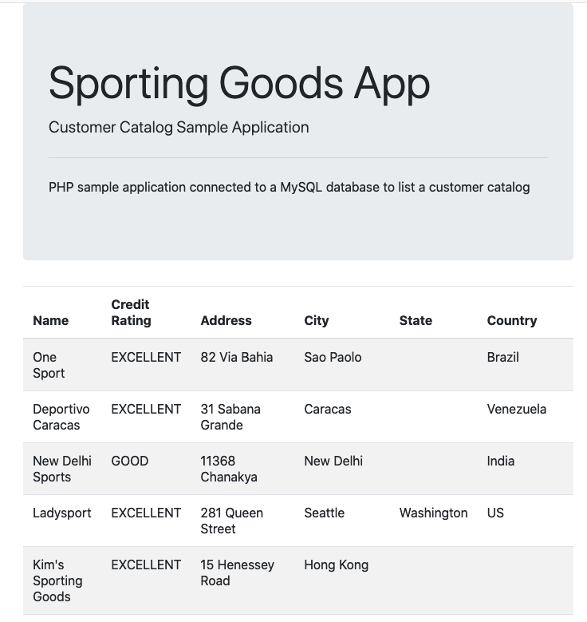

## Google Kubernetes Engine

Google Kubernetes Engine es un servicio gestionado de Kubernetes ofrecido por Google. Ofrece autoescalado horizontal y vertical de pods y nodos.

Un cluster GKE consiste en un grupo de instancias de Google Compute Engine, aunque realmente se pueden tener varios grupos de nodos (zonas diferentes, capacidades diferentes, ...).

Todo lo expuesto anteriormente en este tutorial es perfectamente aplicable a clusters GKE, ya que se ha trabajado con Kubernetes. Lo que veremos a continuación es cómo crear un cluster GKE y cómo configurar `kubectl` para conectarlo al cluster creado en GKE.

### Creación de un cluster Kubernetes en GKE

Las operaciones con GKE se encuentran en el Menú de navegación en `Compute | Kubernetes Engine`. Desde ahí podremos gestionar clusters, Deployments, Services, _volume claims_, ConfigMaps y Secrets.

Para crear un cluster, en `Kubernetes Engine | Clusters` aparecerá un cuadro indicando la posibilidad de crear un nuevo cluster.

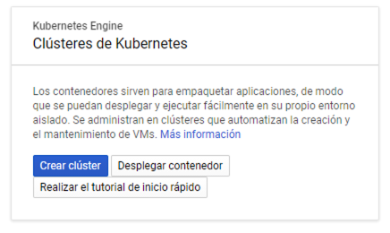

Seleccionamos `Crear cluster`. Aparece el Asistente para la creación de clusters. Para este tutorial se recomienda usar la opción `Mi primer cluster` que aparece en la derecha. Esta crea un cluster sencillo para probar. 

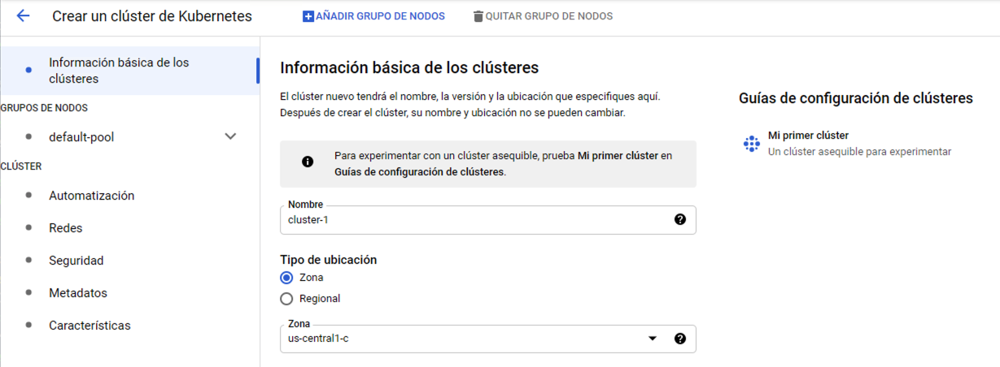

Aparecerá un cuadro informando de los pasos que se van a realizar en el proceso de creación del cluster. Se trata de un cluster de recursos reducidos formado por 3 nodos de 1vCPU y 1,7 GB de RAM cada uno. Las funcionalidades también son reducidas (p.e. tiene deshabilitado el autoescalado de nodos de forma predeterminada). 

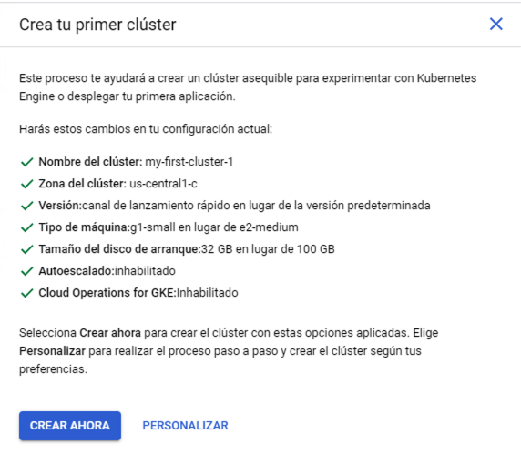

Tras pulsar el botón de creación del cluster y tras un periodo de tiempo el cluster estará creado.

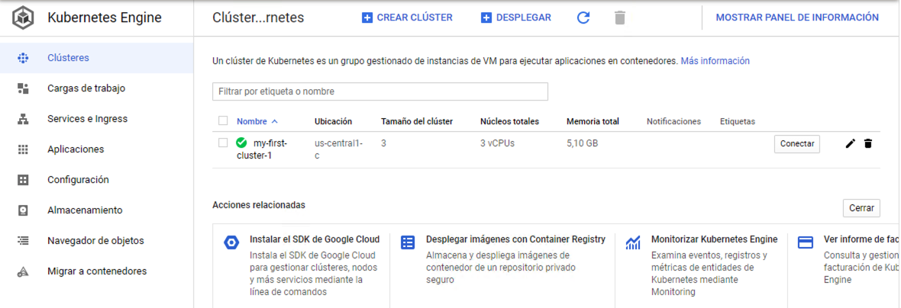

### Interacción con cluster GKE desde `kubectl` local.

Pese a que Google Cloud Shell cuente con `kubectl` queremos operar con el cluster creado desde nuestro equipo ya que en él será donde tengamos los archivos de manifiesto que usaremos para configurar los despliegues en el cluster.

.Descarga de `gcloud`
****
Descargar `gcloud` si no se tiene instalado. Seguir esta guía (https://cloud.google.com/sdk/docs/install). Tras la instalación nos pedirá que conectemos con nuestro usuario y que seleccionemos el proyecto. Así, tendremos disponible el SDK de Google Cloud y quedaremos conectado a nuestro proyecto en Google Cloud.

[NOTE]
====
Si ya se cuenta con `gcloud` instalado y no se tiene configurado contra el proyecto de Google Cloud ejecutar `gcloud init`. Si no existe una configuración creada nos pedirá que conectemos con nuestro usuario y que seleccionemos el proyecto.
====
****

Para obtener las creadenciales de acceso al cluster, en la lista de clusters (`Kubernetes Engine | Clusters`) le damos al botón `Conectar` de nuestro cluster para obtener las credenciales. Nos aparecerá un cuadro de diálogo para obtener las credenciales a incluir en el archivo de configuración de `kubectl` (`~/.kube/config`). la figura muestra el comando que hay que ejecutar para configurar `kubectl` contra nuestro cluster. Copiar ese comando y ejecutarlo en nuestra terminal. No lo ejecutaremos en Cloud Shell porque lo que queremos configurar es nuestro `kubectl`, no el de Cloud Shell.

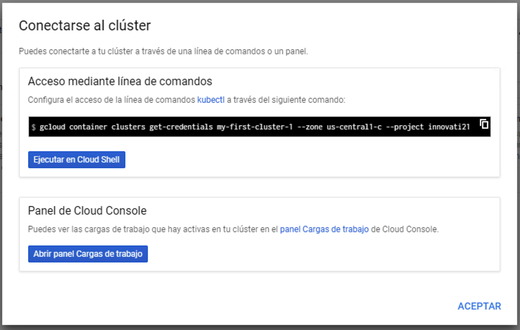

La obtención de las credenciales sigue este patrón

    gcloud container clusters get-credentials <cluster-name> --zone=<compute-zone>
    
A continuación se muestra un ejemplo con la respuesta que devuelve.

[source, bash]
----
$ gcloud container clusters get-credentials my-first-cluster-1 --zone us-central1-c --project innovati21
Fetching cluster endpoint and auth data.
kubeconfig entry generated for my-first-cluster-1
----

En ese momento, `kubectl` ha quedado configurado y conectado al cluster GKE.

Para comprobarlo, haremos un despliegue de prueba:

[source, bash]
----
$ kubectl apply -f https://gist.githubusercontent.com/ualmtorres/a5685c96a7119908a8d0975eff4907f7/raw/2e7d8d3a6ef64e7937e345b933223dceb2ff69d3/k8s-nginx.yml
----

En el menú `Cargas de trabajo` podremos ver el despliegue realizado.

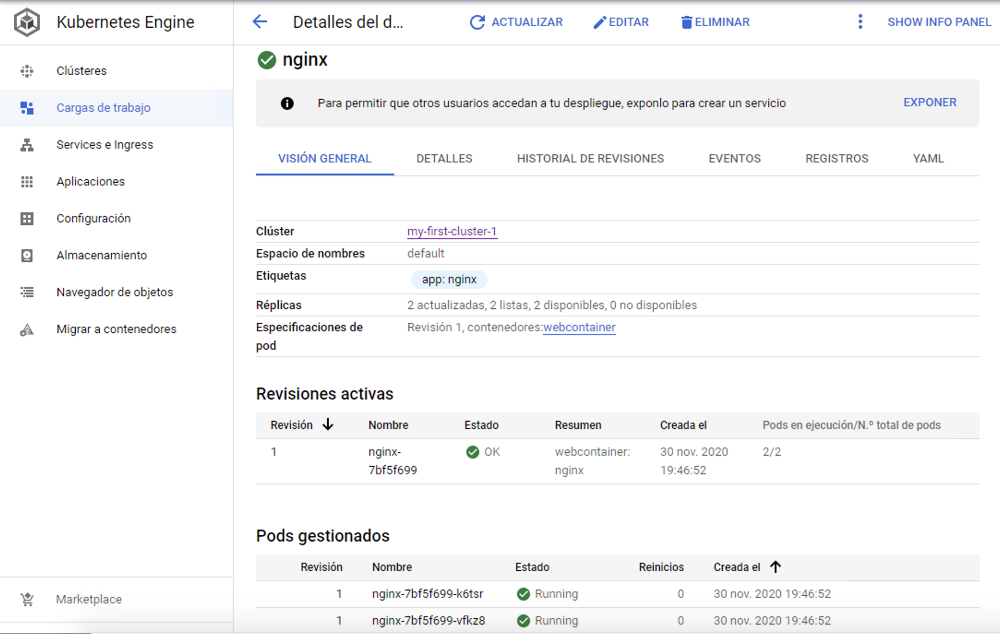

Para ver los pods con `kubectl` ejecutaríamos

[source, bash]
----
$ kubectl get pods
NAME                   READY   STATUS    RESTARTS   AGE
nginx-7bf5f699-k6tsr   1/1     Running   0          6m49s
nginx-7bf5f699-vfkz8   1/1     Running   0          6m49s
----

Para ver alguno de los Nginx funcionando haríamos un _port forward_ 

    $ kubectl port-forward nginx-7bf5f699-k6tsr 80:80

### Parada del cluster

Selecciona, editar, ir a la zona de Grupos de nodos, seleccionar y poner el número de nodos a 0.

### Ampliación del cluster y autoescalado

Selecciona, editar, ir a la zona de Grupos de nodos, seleccionar y poner el número de nodos al deseado.

Seguir los mismos pasos y activar el autoescalado indicando mínimo y máximo de nodos

### Volúmenes NFS con Filestore

Filestore es una solución de Google Cloud para almacenamiento en red gestionado que puede ser usado en instancias de Google Compute Engine y Kubernetes Engine. Filestore tiene compatibilidad con clientes NFS por lo que los usaremos para crear volúmenes https://debian-handbook.info/browse/es-ES/stable/sect.nfs-file-server.html[NFS]. Cada instancia Filestore tendrá una dirección IP (normalmente en una red de Google Cloud) y su almacenamiento mínimo es de 1 TB.

En Filestore definiremos un _share_. Se trata de un directorio de la instancia Filestore en el que se almacenarán los archivos compartidos. Este directorio es el que posteriormente se montará en las instancias de GCE o en los pods de GKE. NFS permite acceso compartido con escritura múltiple, lo que lo hace una solución ideal de almacenamiento en despliegues Kubernetes para gestores de contenidos, análisis de datos, procesamiento compartido y demás escenarios en los que los pods tengan que leer y escribir en un lugar común.

Las instancias Filestore creadas son externas al cluster Kubernetes y son persistentes, de forma que su contenido se mantiene después de la eliminación de los pods que lo tengan montado y de los clusters que lo usen.

[IMPORTANT]
====
La tarifa mínima (diciembre de 2020) de Filestore está en 0.2 €/GB mensuales para HDD y 0.3 €/GB para SSD, lo que supone una facturación que supera los 200 € mensuales en el caso de HDD y los 300 € en el caso de los SDD. Se recomienda no usar este tipo de recursos de forma innecesaria y eliminarlos cuando no sean necesarios en los laboratorios de la asignatura debido a su elevado coste.
====

.Google Cloud Volume Services
****
Otro servicio de almacenamiento compartido y gestionado alternativo a Filestore es Google Cloud Volume Services. Es ofrecido por NetApp y al igual que Filestore el espacio mínimo es de 1 TB. La tarifa por uso mensual va desde 0.10 USD/GB del _standard storage_ hasta los 0.30 USD/GB del _extreme storage_.

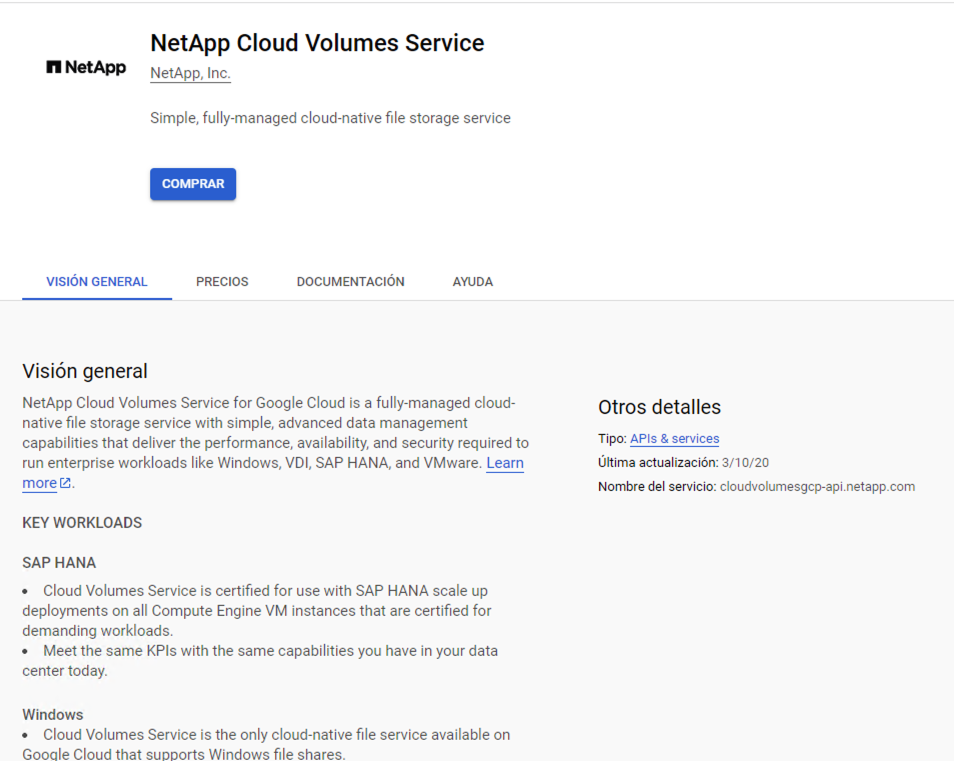

Más información en https://cloud.google.com/solutions/partners/netapp-cloud-volumes/creating-nfs-volumes[Creating and managing NFS volumes] de la documentación de Google Cloud
****

#### Creación de una instancia en Filestore

. En el menú de navegación seleccionar `Almacenamiento | Filestore | Instancias`. Se mostrarán las instancias disponibles. Pulsar el botón `Crear instancia` para abrir el asistente de creación de instancias de Filestore.
. Asignar un nombre (p.e. `nfs-server`).
. En la región y en la zona elegiremos los mismos valores que tengamos en el cluster de Kubernetes para mejorar el rendimiento y reducir el coste de comunicaciones en el intercambio de datos.
. En `Configura tu sistema de archivos compartidos` introducir el nombre del _share_ a crear. Junto con la IP de la instancia Filestore, el nombre del _share_ será el nombre que usemos para acceder al volumen NFS que se va a crear. Introduciremos el valor (p.e. `nfsVolume`).
. Mantener el resto de opciones a los valores predeterminados.
. Pulsar el botón `Crear`. 

Unos minutos más tarde estará creada la instancia Filestore mostrando el ID de la instancia, el nombre del share, dirección IP, capacidad y otras características, como ilustra la figura siguiente.

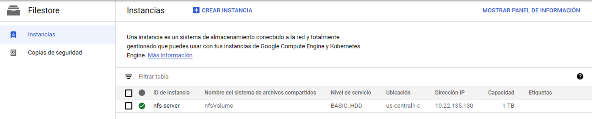

#### Volúmenes persistentes y solicitudes de volumen persistente

Un **volumen persistente** es un espacio de almacenamiento que ha sido creado por un administrador (p.e. creando una instancia de Filestore) o bien ha sido creado de forma dinámica usando https://kubernetes.io/docs/concepts/storage/storage-classes/[Clases de almacenamiento]. `PersistentVolume` es un objeto Kubernetes que captura los detalles de almacenamiento (p.e. en el caso de un servidor NFS tendríamos su tamaño, modo de acceso, servidor NFS, nombre del _share_ y demá).

A continuación se muestra el manifiesto para crear un `PersistentVolume` en el namespace `default` para el _share_ de 1 TB (`nfsVolume`) creado anteriormente en Filestore. Este volumen persistente abstrae al _share_ creado en Filestore.

.Archivo `nfs-persistentvolume.yml`
[source, yaml]
----
apiVersion: v1
kind: PersistentVolume
metadata:
  name: nfs-pv <1>
spec:
  capacity:
    storage: 1T <2>
  accessModes:
    - ReadWriteMany <3>
  persistentVolumeReclaimPolicy: Recycle
  nfs: <4>
    path: /nfsVolume <5>
    server: 10.22.135.130 <6>
----
<1> Nombre del volumen persistente
<2> Capacidad total del almacenamiento creado
<3> Modo de acceso
<4> Tipo del volumen persistente
<5> Nombre creado para el _share_
<6> Servidor NFS creado con Filestore

Desplegaremos el volumen persistente con 

    kubectl apply -f nfs-persistentvolume.yml

Una **solicitud de volumen persistente** es una solicitud de un espacio de almacenamiento dentro de un volumen persistente. Se corresponde con el objeto `PersistentVolumenClaim` de Kubernetes. Por tanto, podemos ver a `PersistentVolume` como un gran espacio de almacenamiento disponible para que nuestras aplicaciones le hagan solicitudes de cuotas más pequeñas (`PersistentVolumeClaim`).

A continuación se muestra el manifiesto para crear un `PersistentVolumeClaim` en el namespace `default` de 10 GB a partir del volumen persistente creado anteriormente. Este espacio obtenido será el que maneje el despliegue que crearemos más adelante.

.Archivo https://gist.githubusercontent.com/ualmtorres/4adbc23ae9237197be32d622bad8876c/raw/3403e9da298c971d739575e0aab8f221e99158e3/nfs-pvc.yaml[`nfs-persistentvolumeclaim.yml`]
[source, yaml]
----
apiVersion: v1
kind: PersistentVolumeClaim
metadata:
  name: nfs-pvc <1>
spec:
  accessModes:
    - ReadWriteMany <2>
  resources:
    requests:
      storage: 10Gi <3>
  volumeName: nfs-pv <4>
  storageClassName: ""
----
<1> Nombre del `PersistentVolumeClaim`
<2> Modo de acceso
<3> Espacio solicitado
<4> Nombre del `PersistentVolume` al que se hace la solicitud

Desplegaremos la solicitud de volumen persistente con 

    kubectl apply -f nfs-persistentvolumeclaim.yml

El volumen aparecerá creado en la zona `Almacenamiento` de `Kubernetes Engine` en la consola de Google Cloud indicando que está conectado (_Bound_).

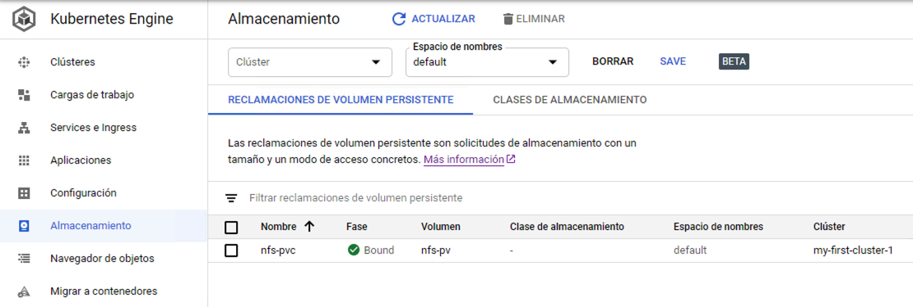

#### Despliegue conectado al volumen NFS

A partir del `PersistentVolumeClaim` creado vamos a desplegar dos pods que estén conectados al volumen y veremos como la escritura por parte de uno ellos en el volumen es vista por el otro. Se trata de un despliegue de un servidor Apache y de un servidor Nginx. Inicialmente no existirá página de inicio por lo que ninguno de ellos mostrará nada. Después, uno de ellos creará la página de inicio en el volumen compartido y se comproborá que los dos puedan mostrarla porque tienen acceso al volumen compartido.

A continuación se muestra el manifiesto para crear un despliegue de Apache en el namespace `default` que monta el `PersistentVolumeClaim` en la carpeta de publicación de Apache.

.Archivo https://gist.githubusercontent.com/ualmtorres/5395c584fac772a28ca201056c0bc081/raw/50f3fcc9264be640b207934d7625ef9fb9fe87cd/nfs-apache-pvc.yaml[`nfs-apache-pvc.yml`]

[source, yaml]
----
apiVersion: apps/v1
kind: Deployment
metadata:
  name: apache-nfs
spec:
  selector:
    matchLabels:
     app: apache
  template:
    metadata:
      labels:
        app: apache
    spec:
      containers:
      - name: apache
        image: httpd
        volumeMounts:
          - mountPath: /usr/local/apache2/htdocs <1>
            name: nfs-vol <2>
        ports:
        - containerPort: 80
      volumes:
        - name: nfs-vol <3>
          persistentVolumeClaim:
            claimName: nfs-pvc <4>
----
<1> Punto de montaje del `PersistentVolumeClaim`
<2> Referencia al `PersistentVolumeClaim` de este despliegue
<3> Nombre que se le da en este despliegue al `PersistentVolumeClaim`
<4> Referencia al objeto `PersistentVolumeClaim` creado de 10 GB

Desplegaremos el manifiesto con 

    kubectl apply -f nfs-apache-pvc.yml

A continuación se muestra el manifiesto para crear un despliegue de Nginx en el namespace `default` que monta el `PersistentVolumeClaim` en la carpeta de publicación de Nginx.

.Archivo https://gist.githubusercontent.com/ualmtorres/9803a507cdfd31c0540e8314118aac3e/raw/a0b0f7fe32f0ce0e5360e1f025698ea28ad66cd2/nfs-nginx-pvc.yaml[`nfs-nginx-pvc.yml`]
[source, yaml]
----
apiVersion: apps/v1
kind: Deployment
metadata:
  name: www-vol
spec:
  selector:
    matchLabels:
     app: nginx
  template:
    metadata:
      labels:
        app: nginx
    spec:
      containers:
      - name: nginx
        image: nginx
        volumeMounts:
          - mountPath: /usr/share/nginx/html <1>
            name: nfs-vol <2>
        ports:
        - containerPort: 80
      volumes:
        - name: nfs-vol <3>
          persistentVolumeClaim:
            claimName: nfs-pvc <4>
----
<1> Punto de montaje del `PersistentVolumeClaim`
<2> Referencia al `PersistentVolumeClaim` de este despliegue
<3> Nombre que se le da en este despliegue al `PersistentVolumeClaim`
<4> Referencia al objeto `PersistentVolumeClaim` creado de 10 GB

A continuación podemos ver en ejecución los pods de los dos despliegues.

[source, bash]
----
$ kubectl get pods
NAME                          READY   STATUS    RESTARTS   AGE
apache-nfs-7f97b85696-gcrhb   1/1     Running   0          3m15s
nginx-nfs-7c579fcbf8-hz9fp    1/1     Running   0          2m4s
----

Vamos a hacer un _port-forward_ a cada pod para ilustrar que ambos no tienen nada aún en su carpeta de publicación.

[source, bash]
----
$ kubectl port-forward apache-nfs-7f97b85696-gcrhb 82:80
Forwarding from 127.0.0.1:82 -> 80
Forwarding from [::1]:82 -> 80

$ kubectl port-forward nginx-nfs-7c579fcbf8-hz9fp 83:80
Forwarding from 127.0.0.1:83 -> 80
Forwarding from [::1]:83 -> 80
----

Inicialmente ni Apache ni Nginx muestran nada porque el volumen que tienen montado en su carpeta de publicación está vacío.

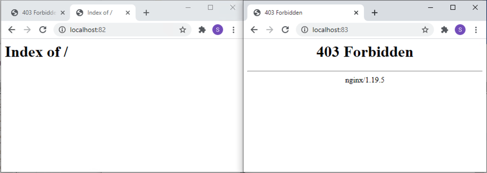

A continuación, el pod de Apache hará una escritura en el volumen NFS. Lo simularemos entrando en el pod de Apache e inicializando el archivo `index.html` con un contenido de prueba `<h1>Volumen NFS</h1>`

[source, html]
----
$ kubectl exec -it apache-nfs-7f97b85696-gcrhb bash

root@apache-nfs-7f97b85696-gcrhb:/usr/local/apache2# echo "<h1>Volumen NFS</h1>" > htdocs/index.html
----

Tras esto, al recargar la página de Apache y de Nginx ambos mostrarán los cambios realizados sobre el volumen NFS compartido.

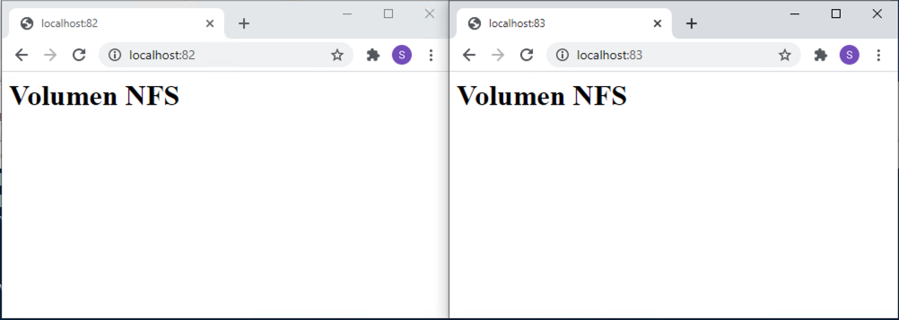

Se trata de un ejemplo burdo pero sencillo donde se ilustra que pods diferentes comparten un espacio común donde ambos pueden escribir. Se trata de ver sólo una muestra de almacenamiento compartido en Kubernetes. Pero esto es aplicable a un ejemplo tan sencillo como este o a otro más complejo de procesamiento colaborativo entre varios pods sobre un espacio compartido.

.Liberación de recursos
****
El almacenamiento en Filestore es un recurso cloud costoso por lo que una vez realizada la prueba ilustrativa en el tutorial procederemos a eliminar los recursos desplegados.

Primero eliminaremos los despliegues de los manifiestos (`Deployment`, `PersistentVolumeClaim` y `PersistentVolume`).

[source, bash]
----
$ kubectl delete -f nfs-nginx-pvc.yaml
$ kubectl delete -f nfs-apache-pvc.yaml
$ kubectl delete -f nfs-persistentvolumeclaim.yaml
$ kubectl delete -f nfs-persistentvolume.yaml
----

A continuación se eliminará la instancia `nfs-server` de Filestore.
****

## Contextos

El archivo `kubeconfig` organiza información de diferentes clusters. Básicamente incluye datos de conexión de clusters y usuarios, y les asigna una alias. Usaremos esos alias para que `kubectl` quede conectado a un cluster o a otro.

Obtener los contextos

[source, bash]
----
$ kubectl config get-contexts
CURRENT   NAME            CLUSTER         AUTHINFO     NAMESPACE
*         minikube        minikube        minikube     default
          produccion-ci   produccion-ci   user-mzmh8   mtorres
...
----

Usar un contexto

[source, bash]
----
$ kubectl config use-context produccion-ci

Switched to context "produccion-ci".
----

Si ahora consultamos los contextos, veremos que el contexto activo es `produccion-ci`. Por tanto, todas las operaciones que hagamos con `kubectl` a partir de ahora se dirigirán contra ese contexto (cluster-usuario-namespace).

[source, bash]
----
$ kubectl config get-contexts
CURRENT   NAME            CLUSTER         AUTHINFO     NAMESPACE
          minikube        minikube        minikube     default
*         produccion-ci   produccion-ci   user-mzmh8   mtorres
----

## HPA. Horizontal Pod Autoscaler

El Horizontal Pod Autoscaler, o HPA pasa simplificar, escala de forma automática el número de réplicas de un pod en función de la observación de métricas de los pods (p.e. el uso de la CPU).

De forma escueta podemos resumir de esta forma su funcionamiento:

* En su definición se fija un mínimo y máximo de réplicas de un deployment
* En su definición se definen las condiciones de stress (p.e. porcentaje de uso de la CPU)
* HPA consulta cada 15s las métricas de uso (CPU, RAM, ...) de cada pod
* Ante stress, HPA escala hacia arriba
* HPA escala hacia abajo tras un periodo de 5 minutos sin stress

image::images/HPA.png[]

A continuación se muestran la redefinición de los Deployment de los ejemplos de la API y de la aplicación del ejemplo del tenis especificando una petición de CPU y memoria para cada pod.

Archivo `tennis-api-deployment-hpa.yml` indicando límites de CPU y memoria:
[source, yaml]
----
apiVersion: apps/v1
kind: Deployment 
metadata:
  name: tennis-api 
  namespace: demo 
  labels:
    app: tennis-api 
spec:
  revisionHistoryLimit: 2 
  strategy:
    type: RollingUpdate 
  replicas: 2 
  selector:
    matchLabels:
      app: tennis-api 
  template: 
    metadata:
      labels: 
        app: tennis-api
    spec:
      containers:
      - name: tennis-api 
        image: ualmtorres/tennis-api:v0 
        ports:
        - name: http
          containerPort: 80
        resources:
          requests:
            cpu: 100m
            memory: 128Mi
          limits:
            cpu: 250m
            memory: 256Mi
----

El despliegue se realiza con `kubectl` con el comando siguiente

[source, bash]
----
$ kubectl apply -f https://gist.githubusercontent.com/ualmtorres/9060280266cbb6c829706aee77eec3f7/raw/e481fee7251a086e30cd3dc2af1c95182cba72bd/tennis-api-hpa.yml
----

[NOTE]
====
La petición de CPU es relativa a unidades teniendo en cuenta lo siguiente:

* 1 CPU equivale a 1 vCPU en un entorno cloud
* 1 Hyperthread en un servidor con procesador Intel con Hyperthreading

Las peticiones se hacen en miliCPUs o en fracciones decimales de CPU. Así una petición de 100m y de 0.1 representan la misma cantidad de CPU solicitada. 

La unidad mínima solicitada es 1m (1 miliCPU).
====

.Qué ocurre si no se especifica un límite de uso de la CPU
****
Cuando no se especifica límite de CPU para un contenedor puede pasar una de estas dos situaciones:

* Si el contenedor está en un namespace que tiene definido un límite de uso de CPU, el contenedor podrá llegar como máximo hasta ese límite. Los administradores del cluster pueden usar `LimitRange` para configurar un tope de uso de la CPU.
* Si no hay límite definido, el contenedor podría llegar todos los recursos de CPU del nodo en el que se está ejecutando.
****

[NOTE]
====
También es posible limitar los recursos de RAM asignados a un contenedor. Consultar la https://kubernetes.io/docs/tasks/configure-pod-container/assign-memory-resource/[documentación oficial sobre la asignación de recursos de RAM a un contenedor] para más información.
====

Archivo `tennis-app-deployment-hpa.yml` indicando límites de CPU y memoria:
[source, yaml]
----
apiVersion: apps/v1
kind: Deployment 
metadata:
  name: tennis-app 
  namespace: demo 
  labels:
    app: tennis-app
spec:
  revisionHistoryLimit: 2 
  strategy:
    type: RollingUpdate 
  replicas: 2 
  selector:
    matchLabels:
      app: tennis-app 
  template: 
    metadata:
      labels: 
        app: tennis-app
    spec:
      containers:
      - name: tennis-app
        image: ualmtorres/tennis-app:v0 
        ports:
        - name: http
          containerPort: 80
        resources:
          requests:
            cpu: 100m
            memory: 128Mi
          limits:
            cpu: 250m
            memory: 256Mi
----

El despliegue se realiza con `kubectl` con el comando siguiente

[source, bash]
----
$ kubectl apply -f https://gist.githubusercontent.com/ualmtorres/3ee88d2ccb75121d61e1c70cfffcaccf/raw/d09e767f9d43c8e01a6a1268b92dc4c12dc7e348/tennis-app-hpa.yml
----

A continuación se muestra el manifiesto que crea un servicio para cada deployment.

[source, bash]
----
apiVersion: v1
kind: Service 
metadata:
  name: tennis-api 
  namespace: demo 
spec:
  type: NodePort 
  ports:
  - name: http
    port: 80 
    targetPort: http
  selector:
    app: tennis-api
---
apiVersion: v1
kind: Service 
metadata:
  name: tennis-app
  namespace: demo 
spec:
  type: LoadBalancer
  ports:
  - name: http
    port: 80 
    targetPort: http
  selector:
    app: tennis-app
----

El despliegue se realiza con `kubectl` con el comando siguiente

[source, bash]
----
$ kubectl apply -f https://gist.githubusercontent.com/ualmtorres/2a0a96749a8b0ced6b8fdd81a9258920/raw/23463255967a4156d1390befdd3bec872ae79bc0/tennis-service.yml
----

Una vez definidos los objetos Deployment y sus Service correspondientes, pasamos a crear el HPA que monitorizará el uso de recursos de los contenedores y solicitará su autoescalado en función del uso de los recursos. En este caso, y para poder ver en acción fácilmente el autoescalado en acción, fijamos que a partir del 15% de uso de la CPU se soliten la creación de nuevos pods. También se indica que el intervalo de escalado esté entre 1 y 10 réplicas según demanda.

[source, bash]
----
apiVersion: autoscaling/v1
kind: HorizontalPodAutoscaler
metadata:
 name: tennis-api
 namespace: demo
spec:
 scaleTargetRef:
   apiVersion: apps/v1beta1
   kind: Deployment
   name: tennis-api
 minReplicas: 1
 maxReplicas: 10
 targetCPUUtilizationPercentage: 15
---
apiVersion: autoscaling/v1
kind: HorizontalPodAutoscaler
metadata:
 name: tennis-app
 namespace: demo
spec:
 scaleTargetRef:
   apiVersion: apps/v1beta1
   kind: Deployment
   name: tennis-app
 minReplicas: 1
 maxReplicas: 10
 targetCPUUtilizationPercentage: 15
----

El despliegue se realiza con `kubectl` con el comando siguiente

[source, bash]
----
$ kubectl apply -f https://gist.githubusercontent.com/ualmtorres/ff53c0d1ff1c00487bf49f1fe78d835e/raw/f2321d2a17343841dac473a6889e6866c33bd60e/tennis-hpa.yml
----

Podemos acceder al estado y condiciones del autoescalado con el comando siguiente.

[source, bash]
----
$  kubectl get hpa -n demo
NAME         REFERENCE               TARGETS         MINPODS   MAXPODS   REPLICAS   AGE
tennis-api   Deployment/tennis-api   <unknown>/15%   1         10        2          51s
tennis-app   Deployment/tennis-app   <unknown>/15%   1         10        2          51s
----

.Weavescope
****
https://www.weave.works/oss/scope/[Weavescope] es una herramienta que nos puede ser muy útil a la hora de controlar cómo escala un despliegue. Con Weavescope podemos ver en vivo el número de réplicas de cada pod conforme se va adaptando a la demanda.

Weavescope está disponible para su despliegue en Kubernetes. Los comandos siguientes instalan Weavescope en nuestro cluster y redirigen su frontend al puerto 4040 a nuestro equipo local.

[source, bash]
----
$ kubectl apply -f "https://cloud.weave.works/k8s/scope.yaml?k8s-version=$(kubectl version | base64 | tr -d '\n')"
$ kubectl port-forward -n weave "$(kubectl get -n weave pod --selector=weave-scope-component=app -o jsonpath='{.items..metadata.name}')" 4040
----

****

### Prueba de stress de autoescalado

https://httpd.apache.org/docs/2.4/programs/ab.html[Apache Benchmark] es una herramienta útil para realizar pruebas de carga. A continuación se muestra cómo hacer una prueba de carga con

* 10.000 peticiones totales
* 10 peticiones simultáneas

[source, bash]
----
$ ab -n 10000 -c 10 http://<ip-aplicacion>/
----

.Instalación de Apache Benchmark
****
Instala Apache Benchmark en una máquina virtual Ubuntu o en la propia Google Cloud Shell para poder hacer las pruebas.

    sudo apt-get install apache2-utils 
****

[NOTE]
====
Este ejemplo ha sido realizado en un cluster GKE. El servicio de la aplicación es de tipo `LoadBalancer` para poder acceder a la aplicación desde Internet.
====

[IMPORTANT]
====
El ejemplo de cluster que hemos definido en este tutorial es bastante pequeño. Inicialmente, sólo cuenta con un 1 nodo de 1 vCPU y 1.7 GB de RAM. Esto puede llevar a la saturación del cluster ante la prueba de stress. Se recomienda aumentar el número de nodos del cluster para que los pods caigan en nodos diferentes y así poder hacer un auténtico escalado horizontal.

Además, si esto se combina con el autoescalado del número de nodos del cluster podemos ver en acción una situación de adaptación totalmente elástica del cluster a los recursos demandados en cuanto a pods y nodos.
====

Las figuras siguientes ilustran varias capturas de cómo ha ido adaptándose el número de pods a la demanda a lo largo de la prueba de carga. Se han usado colores azul, naranja y rojo para ilustrar el estado de stress y la respuesta elástica con el número de pods en distintos estados que se han ido capturando durante la prueba de carga.

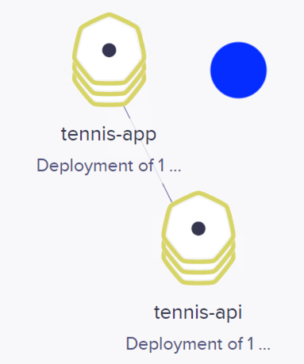
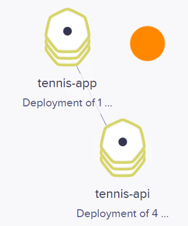
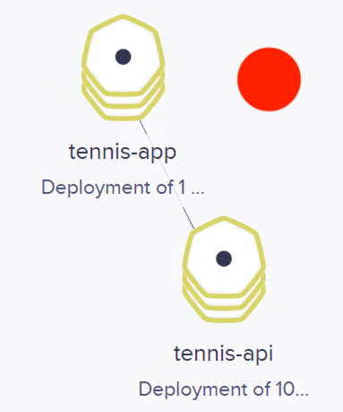

También se muestan algunos de los estados por lo que ha ido pasando el objeto HPA con el comando `kubectl get horizontalpodautoscalers.autoscaling`

[source, bash]
----
$ kubectl get horizontalpodautoscalers.autoscaling -n demo --watch

NAME         REFERENCE               TARGETS   MINPODS   MAXPODS   REPLICAS   AGE
tennis-api   Deployment/tennis-api   1%/15%    1         10        2          3m26s <1>
tennis-app   Deployment/tennis-app   1%/15%    1         10        2          3m26s
tennis-api   Deployment/tennis-api   1%/15%    1         10        1          5m42s <2>
tennis-app   Deployment/tennis-app   1%/15%    1         10        1          5m42s
tennis-app   Deployment/tennis-app   4%/15%    1         10        1          8m44s
tennis-api   Deployment/tennis-api   76%/15%   1         10        4          9m48s <3>
tennis-api   Deployment/tennis-api   1%/15%    1         10        8          11m
tennis-api   Deployment/tennis-api   27%/15%   1         10        10         14m <4>
tennis-api   Deployment/tennis-api   1%/15%    1         10        10         32m
tennis-api   Deployment/tennis-api   1%/15%    1         10        8          32m <5>
tennis-api   Deployment/tennis-api   1%/15%    1         10        8          33m
tennis-api   Deployment/tennis-api   1%/15%    1         10        7          33m
tennis-api   Deployment/tennis-api   1%/15%    1         10        4          34m
tennis-api   Deployment/tennis-api   1%/15%    1         10        1          34m <6>
----
<1> Estado inicial con dos réplicas
<2> Ante actividad baja, el número de réplicas desciende a 1
<3> Ante stress de la CPU, el número de réplicas aumenta
<4> Límite de réplicas alcanzando el límite
<5> A medida que baja la carga también baja el número de réplicas
<6> Ante un estado tranquilo, el número de réplicas desciende al mínimo

image::images/weave-scope-cold.png[]

